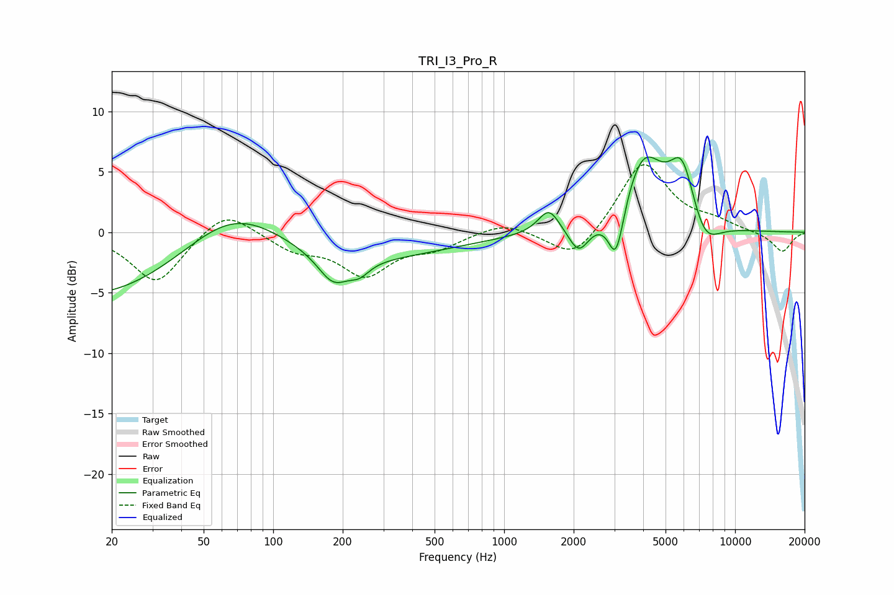

# TRI_I3_Pro_R
See [usage instructions](https://github.com/jaakkopasanen/AutoEq#usage) for more options and info.

### Parametric EQs
Apply preamp of -6.3 dB when using parametric equalizer.

|   # | Type    |   Fc (Hz) |    Q |   Gain (dB) |
|-----|---------|-----------|------|-------------|
|   1 | Peaking |        52 | 0.18 |       -14.1 |
|   2 | Peaking |        67 | 0.35 |        14.7 |
|   3 | Peaking |       182 | 2.13 |        -2.4 |
|   4 | Peaking |       236 | 3.14 |        -1   |
|   5 | Peaking |      1562 | 3.13 |         2   |
|   6 | Peaking |      2104 | 3.24 |        -2.3 |
|   7 | Peaking |      3053 | 4.19 |        -4.5 |
|   8 | Peaking |      4017 | 1.62 |         6   |
|   9 | Peaking |      5903 | 2.41 |         5.1 |
|  10 | Peaking |      7331 | 2.09 |        -2.5 |

### Fixed Band EQs
When using fixed band (also called graphic) equalizer, apply preamp of **-5.7 dB** (if available) and set gains manually with these parameters.

|   # | Type    |   Fc (Hz) |    Q |   Gain (dB) |
|-----|---------|-----------|------|-------------|
|   1 | Peaking |        31 | 1.41 |        -4.2 |
|   2 | Peaking |        62 | 1.41 |         2.1 |
|   3 | Peaking |       125 | 1.41 |        -1.3 |
|   4 | Peaking |       250 | 1.41 |        -3.3 |
|   5 | Peaking |       500 | 1.41 |        -1.1 |
|   6 | Peaking |      1000 | 1.41 |         0.9 |
|   7 | Peaking |      2000 | 1.41 |        -2.5 |
|   8 | Peaking |      4000 | 1.41 |         5.9 |
|   9 | Peaking |      8000 | 1.41 |         0.7 |
|  10 | Peaking |     16000 | 1.41 |        -1.7 |

### Graphs

