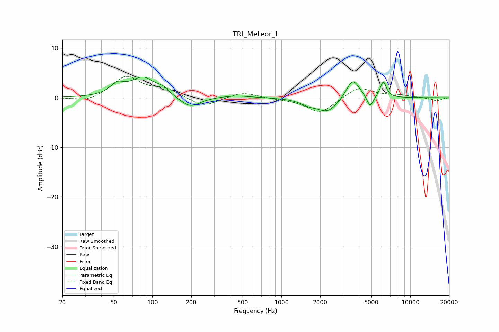

# TRI_Meteor_L
See [usage instructions](https://github.com/jaakkopasanen/AutoEq#usage) for more options and info.

### Parametric EQs
Apply preamp of -4.3 dB when using parametric equalizer.

|   # | Type    |   Fc (Hz) |    Q |   Gain (dB) |
|-----|---------|-----------|------|-------------|
|   1 | Peaking |        53 | 2.69 |         2   |
|   2 | Peaking |        85 | 1.45 |         3.9 |
|   3 | Peaking |       121 | 3.38 |         0.9 |
|   4 | Peaking |       195 | 1.85 |        -2.2 |
|   5 | Peaking |       439 | 1.21 |         0.5 |
|   6 | Peaking |      1623 | 2.25 |        -0.9 |
|   7 | Peaking |      2294 | 1.72 |        -2.8 |
|   8 | Peaking |      3578 | 2.72 |         4.1 |
|   9 | Peaking |      4885 | 5.68 |        -2.4 |
|  10 | Peaking |      6173 | 5.75 |         3.2 |

### Fixed Band EQs
When using fixed band (also called graphic) equalizer, apply preamp of **-4.4 dB** (if available) and set gains manually with these parameters.

|   # | Type    |   Fc (Hz) |    Q |   Gain (dB) |
|-----|---------|-----------|------|-------------|
|   1 | Peaking |        31 | 1.41 |        -1   |
|   2 | Peaking |        62 | 1.41 |         4.3 |
|   3 | Peaking |       125 | 1.41 |         1.6 |
|   4 | Peaking |       250 | 1.41 |        -1.9 |
|   5 | Peaking |       500 | 1.41 |         1.2 |
|   6 | Peaking |      1000 | 1.41 |        -0.2 |
|   7 | Peaking |      2000 | 1.41 |        -3.1 |
|   8 | Peaking |      4000 | 1.41 |         2.2 |
|   9 | Peaking |      8000 | 1.41 |         0.5 |
|  10 | Peaking |     16000 | 1.41 |        -0.6 |

### Graphs

