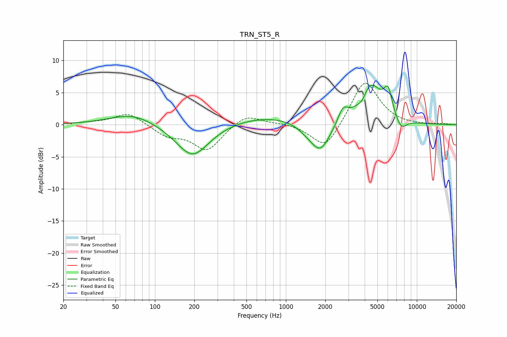

# TRN_ST5_R
See [usage instructions](https://github.com/jaakkopasanen/AutoEq#usage) for more options and info.

### Parametric EQs
Apply preamp of -6.3 dB when using parametric equalizer.

|   # | Type    |   Fc (Hz) |    Q |   Gain (dB) |
|-----|---------|-----------|------|-------------|
|   1 | Peaking |        68 | 0.83 |         1.8 |
|   2 | Peaking |       194 | 1.12 |        -5.2 |
|   3 | Peaking |       750 | 0.45 |         1.4 |
|   4 | Peaking |      1489 | 1.68 |        -1   |
|   5 | Peaking |      1844 | 1.87 |        -4.3 |
|   6 | Peaking |      2732 | 3.79 |         2.2 |
|   7 | Peaking |      3821 | 4.3  |        -1.1 |
|   8 | Peaking |      4430 | 1.66 |         6.2 |
|   9 | Peaking |      6028 | 4.12 |         3.8 |
|  10 | Peaking |      7552 | 3.15 |        -1.9 |

### Fixed Band EQs
When using fixed band (also called graphic) equalizer, apply preamp of **-6.5 dB** (if available) and set gains manually with these parameters.

|   # | Type    |   Fc (Hz) |    Q |   Gain (dB) |
|-----|---------|-----------|------|-------------|
|   1 | Peaking |        31 | 1.41 |         0.2 |
|   2 | Peaking |        62 | 1.41 |         1.9 |
|   3 | Peaking |       125 | 1.41 |        -1.6 |
|   4 | Peaking |       250 | 1.41 |        -3.9 |
|   5 | Peaking |       500 | 1.41 |         1.8 |
|   6 | Peaking |      1000 | 1.41 |         0.3 |
|   7 | Peaking |      2000 | 1.41 |        -4.1 |
|   8 | Peaking |      4000 | 1.41 |         7.2 |
|   9 | Peaking |      8000 | 1.41 |        -0.1 |
|  10 | Peaking |     16000 | 1.41 |         0.1 |

### Graphs

