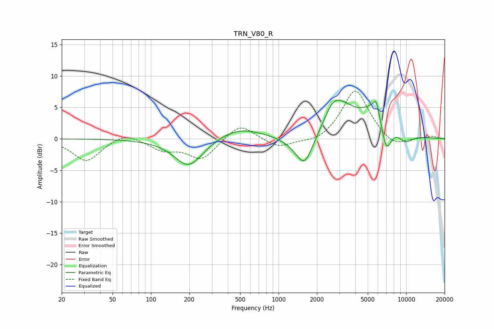

# TRN_V80_R
See [usage instructions](https://github.com/jaakkopasanen/AutoEq#usage) for more options and info.

### Parametric EQs
Apply preamp of -6.2 dB when using parametric equalizer.

|   # | Type    |   Fc (Hz) |    Q |   Gain (dB) |
|-----|---------|-----------|------|-------------|
|   1 | Peaking |       198 | 1.24 |        -4.6 |
|   2 | Peaking |       486 | 0.78 |         1.9 |
|   3 | Peaking |      1311 | 1.62 |        -0.5 |
|   4 | Peaking |      1600 | 2.15 |        -4.7 |
|   5 | Peaking |      2700 | 1.8  |         4.5 |
|   6 | Peaking |      3410 | 1.77 |         1.7 |
|   7 | Peaking |      5814 | 6    |         2.1 |
|   8 | Peaking |      5951 | 1.05 |         5.7 |
|   9 | Peaking |      6977 | 2.99 |        -6.1 |
|  10 | Peaking |      9801 | 1.97 |        -1.8 |

### Fixed Band EQs
When using fixed band (also called graphic) equalizer, apply preamp of **-7.7 dB** (if available) and set gains manually with these parameters.

|   # | Type    |   Fc (Hz) |    Q |   Gain (dB) |
|-----|---------|-----------|------|-------------|
|   1 | Peaking |        31 | 1.41 |        -3.6 |
|   2 | Peaking |        62 | 1.41 |         1.2 |
|   3 | Peaking |       125 | 1.41 |        -1.6 |
|   4 | Peaking |       250 | 1.41 |        -3.2 |
|   5 | Peaking |       500 | 1.41 |         2.6 |
|   6 | Peaking |      1000 | 1.41 |        -1.5 |
|   7 | Peaking |      2000 | 1.41 |        -0.9 |
|   8 | Peaking |      4000 | 1.41 |         8   |
|   9 | Peaking |      8000 | 1.41 |        -1.5 |
|  10 | Peaking |     16000 | 1.41 |         0.4 |

### Graphs

