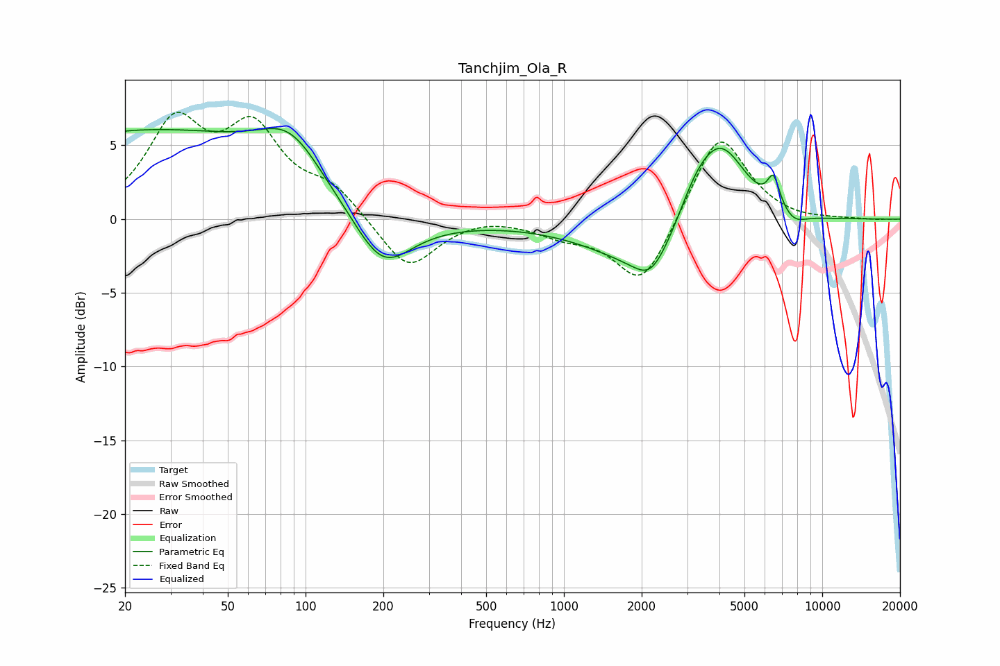

# Tanchjim_Ola_R
See [usage instructions](https://github.com/jaakkopasanen/AutoEq#usage) for more options and info.

### Parametric EQs
Apply preamp of -6.2 dB when using parametric equalizer.

|   # | Type    |   Fc (Hz) |    Q |   Gain (dB) |
|-----|---------|-----------|------|-------------|
|   1 | Peaking |        25 | 0.22 |         6   |
|   2 | Peaking |        87 | 1.17 |         3.1 |
|   3 | Peaking |       163 | 0.45 |        -0.8 |
|   4 | Peaking |       198 | 1.28 |        -3.7 |
|   5 | Peaking |      2162 | 2.35 |        -1.5 |
|   6 | Peaking |      2513 | 0.64 |        -4.6 |
|   7 | Peaking |      3219 | 1.62 |         3   |
|   8 | Peaking |      4073 | 1.28 |         6.2 |
|   9 | Peaking |      6479 | 5.65 |         2.1 |
|  10 | Peaking |      7784 | 2.87 |        -0.7 |

### Fixed Band EQs
When using fixed band (also called graphic) equalizer, apply preamp of **-7.3 dB** (if available) and set gains manually with these parameters.

|   # | Type    |   Fc (Hz) |    Q |   Gain (dB) |
|-----|---------|-----------|------|-------------|
|   1 | Peaking |        31 | 1.41 |         6.1 |
|   2 | Peaking |        62 | 1.41 |         5.5 |
|   3 | Peaking |       125 | 1.41 |         1.9 |
|   4 | Peaking |       250 | 1.41 |        -3.5 |
|   5 | Peaking |       500 | 1.41 |         0.3 |
|   6 | Peaking |      1000 | 1.41 |        -0.9 |
|   7 | Peaking |      2000 | 1.41 |        -4.6 |
|   8 | Peaking |      4000 | 1.41 |         6.1 |
|   9 | Peaking |      8000 | 1.41 |        -0.2 |
|  10 | Peaking |     16000 | 1.41 |        -0   |

### Graphs

