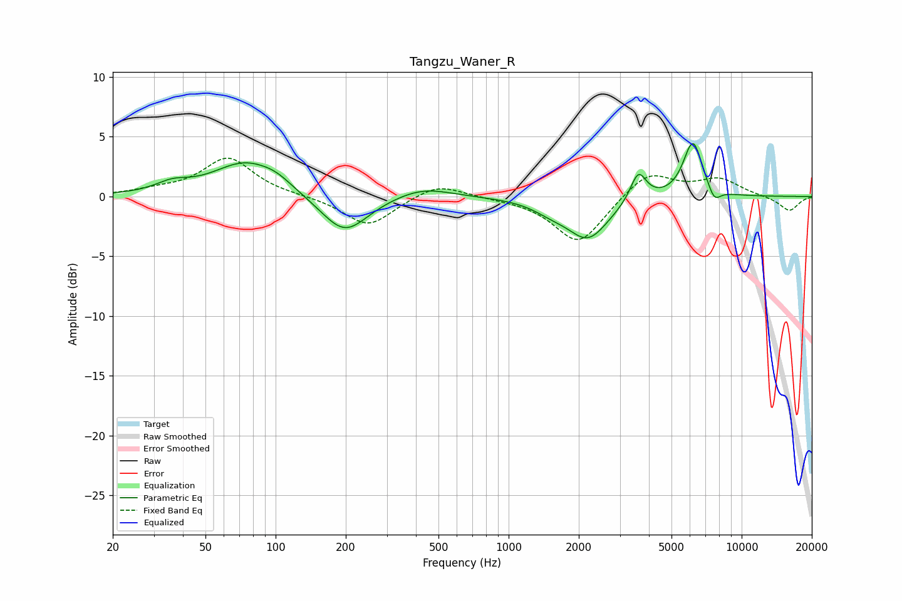

# Tangzu_Waner_R
See [usage instructions](https://github.com/jaakkopasanen/AutoEq#usage) for more options and info.

### Parametric EQs
Apply preamp of -4.5 dB when using parametric equalizer.

|   # | Type    |   Fc (Hz) |    Q |   Gain (dB) |
|-----|---------|-----------|------|-------------|
|   1 | Peaking |        36 | 2.02 |         0.7 |
|   2 | Peaking |        74 | 1.02 |         2.8 |
|   3 | Peaking |       101 | 2.1  |         0.6 |
|   4 | Peaking |       197 | 1.4  |        -3.3 |
|   5 | Peaking |       428 | 1.17 |         0.9 |
|   6 | Peaking |      1514 | 1.8  |        -0.7 |
|   7 | Peaking |      2192 | 1.58 |        -3.4 |
|   8 | Peaking |      3603 | 4.09 |         2.5 |
|   9 | Peaking |      6178 | 3.29 |         4.7 |
|  10 | Peaking |      7625 | 4.85 |        -1.2 |

### Fixed Band EQs
When using fixed band (also called graphic) equalizer, apply preamp of **-3.3 dB** (if available) and set gains manually with these parameters.

|   # | Type    |   Fc (Hz) |    Q |   Gain (dB) |
|-----|---------|-----------|------|-------------|
|   1 | Peaking |        31 | 1.41 |         0.4 |
|   2 | Peaking |        62 | 1.41 |         3.2 |
|   3 | Peaking |       125 | 1.41 |         0   |
|   4 | Peaking |       250 | 1.41 |        -2.5 |
|   5 | Peaking |       500 | 1.41 |         1.2 |
|   6 | Peaking |      1000 | 1.41 |        -0.1 |
|   7 | Peaking |      2000 | 1.41 |        -4   |
|   8 | Peaking |      4000 | 1.41 |         2.2 |
|   9 | Peaking |      8000 | 1.41 |         1.4 |
|  10 | Peaking |     16000 | 1.41 |        -1.2 |

### Graphs

