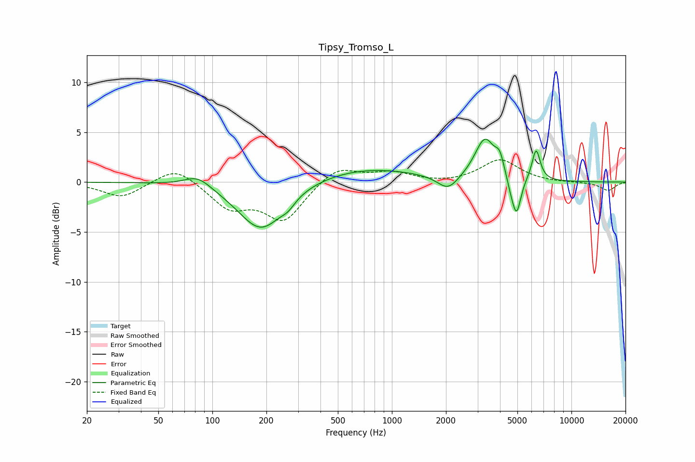

# Tipsy_Tromso_L
See [usage instructions](https://github.com/jaakkopasanen/AutoEq#usage) for more options and info.

### Parametric EQs
Apply preamp of -4.4 dB when using parametric equalizer.

|   # | Type    |   Fc (Hz) |    Q |   Gain (dB) |
|-----|---------|-----------|------|-------------|
|   1 | Peaking |        83 | 1.91 |         1.2 |
|   2 | Peaking |       187 | 1.1  |        -4.9 |
|   3 | Peaking |       264 | 3.83 |        -0.6 |
|   4 | Peaking |       701 | 0.47 |         1.4 |
|   5 | Peaking |      2055 | 2.41 |        -1.5 |
|   6 | Peaking |      3298 | 2.49 |         4.2 |
|   7 | Peaking |      3985 | 5.9  |         1.5 |
|   8 | Peaking |      4599 | 6    |        -1   |
|   9 | Peaking |      4949 | 5.74 |        -3.6 |
|  10 | Peaking |      6354 | 6    |         3.2 |

### Fixed Band EQs
When using fixed band (also called graphic) equalizer, apply preamp of **-2.3 dB** (if available) and set gains manually with these parameters.

|   # | Type    |   Fc (Hz) |    Q |   Gain (dB) |
|-----|---------|-----------|------|-------------|
|   1 | Peaking |        31 | 1.41 |        -1.6 |
|   2 | Peaking |        62 | 1.41 |         1.7 |
|   3 | Peaking |       125 | 1.41 |        -2.5 |
|   4 | Peaking |       250 | 1.41 |        -3.7 |
|   5 | Peaking |       500 | 1.41 |         1.6 |
|   6 | Peaking |      1000 | 1.41 |         0.9 |
|   7 | Peaking |      2000 | 1.41 |        -0.2 |
|   8 | Peaking |      4000 | 1.41 |         2.2 |
|   9 | Peaking |      8000 | 1.41 |        -0.1 |
|  10 | Peaking |     16000 | 1.41 |        -0.8 |

### Graphs

