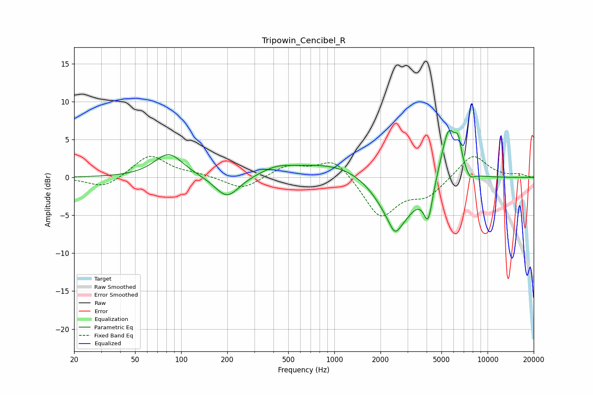

# Tripowin_Cencibel_R
See [usage instructions](https://github.com/jaakkopasanen/AutoEq#usage) for more options and info.

### Parametric EQs
Apply preamp of -6.3 dB when using parametric equalizer.

|   # | Type    |   Fc (Hz) |    Q |   Gain (dB) |
|-----|---------|-----------|------|-------------|
|   1 | Peaking |        83 | 1.52 |         3.2 |
|   2 | Peaking |       199 | 1.76 |        -3   |
|   3 | Peaking |       421 | 1.45 |         0.8 |
|   4 | Peaking |      1121 | 0.46 |         2.3 |
|   5 | Peaking |      2479 | 4.36 |        -1.4 |
|   6 | Peaking |      2537 | 1.14 |        -7.2 |
|   7 | Peaking |      4095 | 4.76 |        -4.7 |
|   8 | Peaking |      5555 | 2.72 |         7.1 |
|   9 | Peaking |      6425 | 5.98 |         2.8 |
|  10 | Peaking |      7678 | 4.49 |        -1   |

### Fixed Band EQs
When using fixed band (also called graphic) equalizer, apply preamp of **-2.9 dB** (if available) and set gains manually with these parameters.

|   # | Type    |   Fc (Hz) |    Q |   Gain (dB) |
|-----|---------|-----------|------|-------------|
|   1 | Peaking |        31 | 1.41 |        -1.5 |
|   2 | Peaking |        62 | 1.41 |         3   |
|   3 | Peaking |       125 | 1.41 |         0.4 |
|   4 | Peaking |       250 | 1.41 |        -1.7 |
|   5 | Peaking |       500 | 1.41 |         1.5 |
|   6 | Peaking |      1000 | 1.41 |         2.6 |
|   7 | Peaking |      2000 | 1.41 |        -5.3 |
|   8 | Peaking |      4000 | 1.41 |        -2.3 |
|   9 | Peaking |      8000 | 1.41 |         3.2 |
|  10 | Peaking |     16000 | 1.41 |         0.4 |

### Graphs

