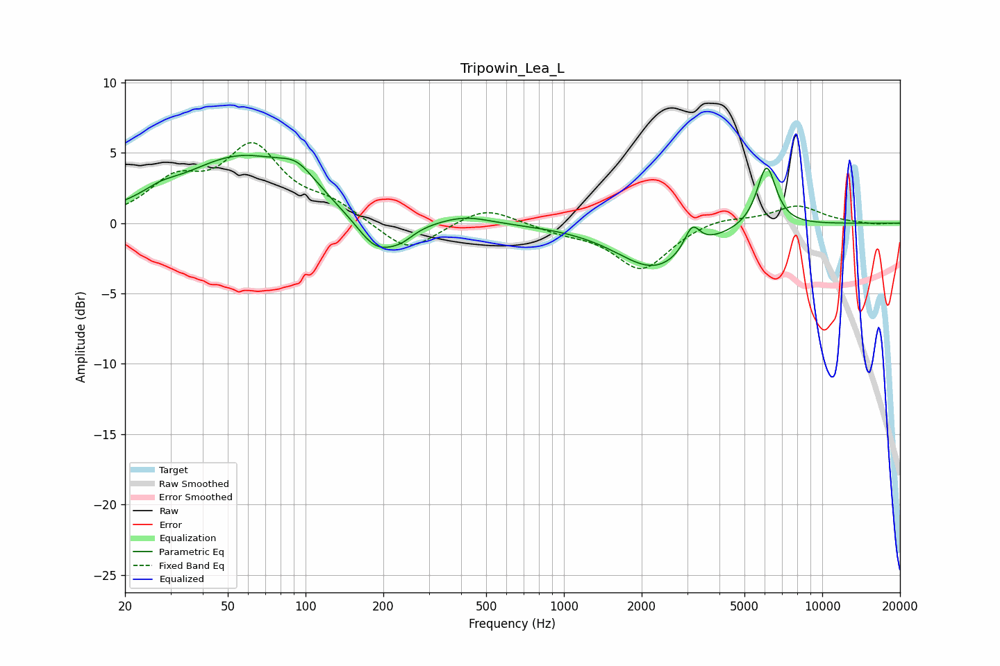

# Tripowin_Lea_L
See [usage instructions](https://github.com/jaakkopasanen/AutoEq#usage) for more options and info.

### Parametric EQs
Apply preamp of -4.9 dB when using parametric equalizer.

|   # | Type    |   Fc (Hz) |    Q |   Gain (dB) |
|-----|---------|-----------|------|-------------|
|   1 | Peaking |        27 | 2.22 |         0.5 |
|   2 | Peaking |        56 | 0.6  |         4.6 |
|   3 | Peaking |        93 | 2.03 |         1.4 |
|   4 | Peaking |       188 | 1.72 |        -2.6 |
|   5 | Peaking |       236 | 2.81 |        -0.7 |
|   6 | Peaking |       417 | 1.55 |         0.5 |
|   7 | Peaking |      2221 | 1.17 |        -0.1 |
|   8 | Peaking |      2252 | 0.95 |        -3.1 |
|   9 | Peaking |      3137 | 4.67 |         1.8 |
|  10 | Peaking |      6085 | 3.71 |         4.4 |

### Fixed Band EQs
When using fixed band (also called graphic) equalizer, apply preamp of **-5.8 dB** (if available) and set gains manually with these parameters.

|   # | Type    |   Fc (Hz) |    Q |   Gain (dB) |
|-----|---------|-----------|------|-------------|
|   1 | Peaking |        31 | 1.41 |         2.6 |
|   2 | Peaking |        62 | 1.41 |         5.1 |
|   3 | Peaking |       125 | 1.41 |         1.2 |
|   4 | Peaking |       250 | 1.41 |        -2.2 |
|   5 | Peaking |       500 | 1.41 |         1.2 |
|   6 | Peaking |      1000 | 1.41 |        -0.5 |
|   7 | Peaking |      2000 | 1.41 |        -3.3 |
|   8 | Peaking |      4000 | 1.41 |         0.5 |
|   9 | Peaking |      8000 | 1.41 |         1.2 |
|  10 | Peaking |     16000 | 1.41 |        -0.1 |

### Graphs

