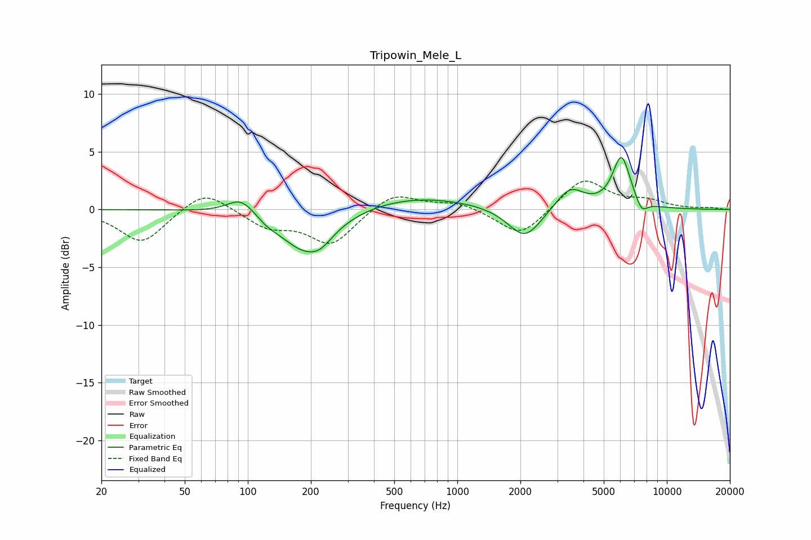

# Tripowin_Mele_L
See [usage instructions](https://github.com/jaakkopasanen/AutoEq#usage) for more options and info.

### Parametric EQs
Apply preamp of -4.6 dB when using parametric equalizer.

|   # | Type    |   Fc (Hz) |    Q |   Gain (dB) |
|-----|---------|-----------|------|-------------|
|   1 | Peaking |        93 | 2.17 |         1.4 |
|   2 | Peaking |       120 | 1.61 |         0.5 |
|   3 | Peaking |       123 | 2.49 |        -0.7 |
|   4 | Peaking |       189 | 1.12 |        -3.7 |
|   5 | Peaking |       223 | 2.74 |        -0.7 |
|   6 | Peaking |       628 | 0.52 |         1.2 |
|   7 | Peaking |      2101 | 1.77 |        -2.8 |
|   8 | Peaking |      3445 | 2.08 |         1.9 |
|   9 | Peaking |      6072 | 3.23 |         4.5 |
|  10 | Peaking |      7579 | 4.84 |        -1.1 |

### Fixed Band EQs
When using fixed band (also called graphic) equalizer, apply preamp of **-2.6 dB** (if available) and set gains manually with these parameters.

|   # | Type    |   Fc (Hz) |    Q |   Gain (dB) |
|-----|---------|-----------|------|-------------|
|   1 | Peaking |        31 | 1.41 |        -2.9 |
|   2 | Peaking |        62 | 1.41 |         1.9 |
|   3 | Peaking |       125 | 1.41 |        -1.4 |
|   4 | Peaking |       250 | 1.41 |        -3   |
|   5 | Peaking |       500 | 1.41 |         1.6 |
|   6 | Peaking |      1000 | 1.41 |         0.7 |
|   7 | Peaking |      2000 | 1.41 |        -2.4 |
|   8 | Peaking |      4000 | 1.41 |         2.7 |
|   9 | Peaking |      8000 | 1.41 |         0.7 |
|  10 | Peaking |     16000 | 1.41 |         0.1 |

### Graphs

