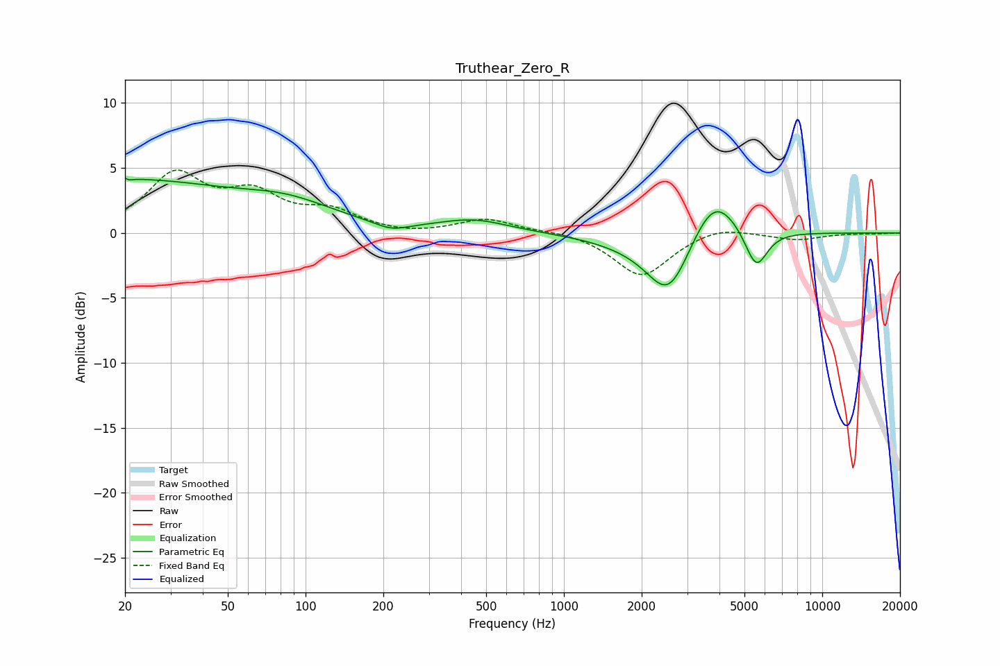

# Truthear_Zero_R
See [usage instructions](https://github.com/jaakkopasanen/AutoEq#usage) for more options and info.

### Parametric EQs
Apply preamp of -4.3 dB when using parametric equalizer.

|   # | Type    |   Fc (Hz) |    Q |   Gain (dB) |
|-----|---------|-----------|------|-------------|
|   1 | Peaking |        20 | 5.49 |         3.1 |
|   2 | Peaking |        20 | 5.95 |        -2.9 |
|   3 | Peaking |        21 | 0.38 |         3.8 |
|   4 | Peaking |        85 | 0.73 |         1.7 |
|   5 | Peaking |       215 | 2.15 |        -0.6 |
|   6 | Peaking |       448 | 1.04 |         1   |
|   7 | Peaking |      2122 | 0.81 |        -0.9 |
|   8 | Peaking |      2552 | 1.73 |        -4.4 |
|   9 | Peaking |      3805 | 1.54 |         3.8 |
|  10 | Peaking |      5550 | 3.17 |        -3.1 |

### Fixed Band EQs
When using fixed band (also called graphic) equalizer, apply preamp of **-4.9 dB** (if available) and set gains manually with these parameters.

|   # | Type    |   Fc (Hz) |    Q |   Gain (dB) |
|-----|---------|-----------|------|-------------|
|   1 | Peaking |        31 | 1.41 |         4.3 |
|   2 | Peaking |        62 | 1.41 |         2.6 |
|   3 | Peaking |       125 | 1.41 |         1.5 |
|   4 | Peaking |       250 | 1.41 |        -0.2 |
|   5 | Peaking |       500 | 1.41 |         1.1 |
|   6 | Peaking |      1000 | 1.41 |         0.2 |
|   7 | Peaking |      2000 | 1.41 |        -3.4 |
|   8 | Peaking |      4000 | 1.41 |         0.6 |
|   9 | Peaking |      8000 | 1.41 |        -0.5 |
|  10 | Peaking |     16000 | 1.41 |        -0   |

### Graphs

