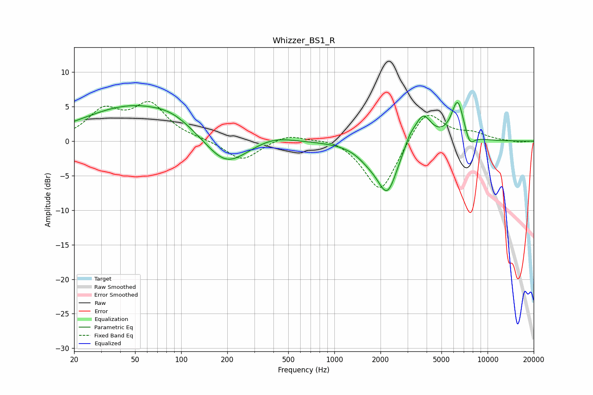

# Whizzer_BS1_R
See [usage instructions](https://github.com/jaakkopasanen/AutoEq#usage) for more options and info.

### Parametric EQs
Apply preamp of -5.7 dB when using parametric equalizer.

|   # | Type    |   Fc (Hz) |    Q |   Gain (dB) |
|-----|---------|-----------|------|-------------|
|   1 | Peaking |        48 | 0.44 |         5   |
|   2 | Peaking |        88 | 1.11 |         1.1 |
|   3 | Peaking |       196 | 1.04 |        -4.3 |
|   4 | Peaking |       402 | 1.14 |         0.9 |
|   5 | Peaking |      1676 | 1.8  |        -1.4 |
|   6 | Peaking |      2218 | 2.11 |        -7.1 |
|   7 | Peaking |      3108 | 3.92 |         1.3 |
|   8 | Peaking |      3785 | 2.56 |         4.1 |
|   9 | Peaking |      6373 | 3.33 |         5.8 |
|  10 | Peaking |      7646 | 4.51 |        -1.9 |

### Fixed Band EQs
When using fixed band (also called graphic) equalizer, apply preamp of **-5.8 dB** (if available) and set gains manually with these parameters.

|   # | Type    |   Fc (Hz) |    Q |   Gain (dB) |
|-----|---------|-----------|------|-------------|
|   1 | Peaking |        31 | 1.41 |         4.1 |
|   2 | Peaking |        62 | 1.41 |         5   |
|   3 | Peaking |       125 | 1.41 |         0.2 |
|   4 | Peaking |       250 | 1.41 |        -2.9 |
|   5 | Peaking |       500 | 1.41 |         1.1 |
|   6 | Peaking |      1000 | 1.41 |         0.7 |
|   7 | Peaking |      2000 | 1.41 |        -7.7 |
|   8 | Peaking |      4000 | 1.41 |         4.9 |
|   9 | Peaking |      8000 | 1.41 |         1   |
|  10 | Peaking |     16000 | 1.41 |        -0.2 |

### Graphs

