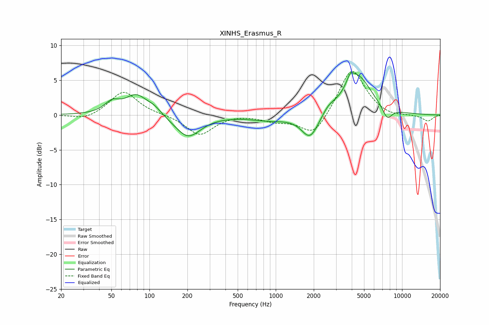

# XINHS_Erasmus_R
See [usage instructions](https://github.com/jaakkopasanen/AutoEq#usage) for more options and info.

### Parametric EQs
Apply preamp of -6.2 dB when using parametric equalizer.

|   # | Type    |   Fc (Hz) |    Q |   Gain (dB) |
|-----|---------|-----------|------|-------------|
|   1 | Peaking |        51 | 2.41 |         1.5 |
|   2 | Peaking |        79 | 1.63 |         2.8 |
|   3 | Peaking |       109 | 2.49 |         0.8 |
|   4 | Peaking |       202 | 1.4  |        -3.2 |
|   5 | Peaking |       898 | 0.95 |        -0.7 |
|   6 | Peaking |      1871 | 2.06 |        -3.6 |
|   7 | Peaking |      2617 | 3.02 |         0.8 |
|   8 | Peaking |      3889 | 5.19 |         1.3 |
|   9 | Peaking |      4440 | 1.27 |         5.6 |
|  10 | Peaking |      7630 | 3.49 |        -1.8 |

### Fixed Band EQs
When using fixed band (also called graphic) equalizer, apply preamp of **-6.4 dB** (if available) and set gains manually with these parameters.

|   # | Type    |   Fc (Hz) |    Q |   Gain (dB) |
|-----|---------|-----------|------|-------------|
|   1 | Peaking |        31 | 1.41 |        -0.8 |
|   2 | Peaking |        62 | 1.41 |         3.5 |
|   3 | Peaking |       125 | 1.41 |         0.1 |
|   4 | Peaking |       250 | 1.41 |        -2.9 |
|   5 | Peaking |       500 | 1.41 |         0.2 |
|   6 | Peaking |      1000 | 1.41 |        -0.8 |
|   7 | Peaking |      2000 | 1.41 |        -3.2 |
|   8 | Peaking |      4000 | 1.41 |         6.9 |
|   9 | Peaking |      8000 | 1.41 |        -0.4 |
|  10 | Peaking |     16000 | 1.41 |        -0.9 |

### Graphs

