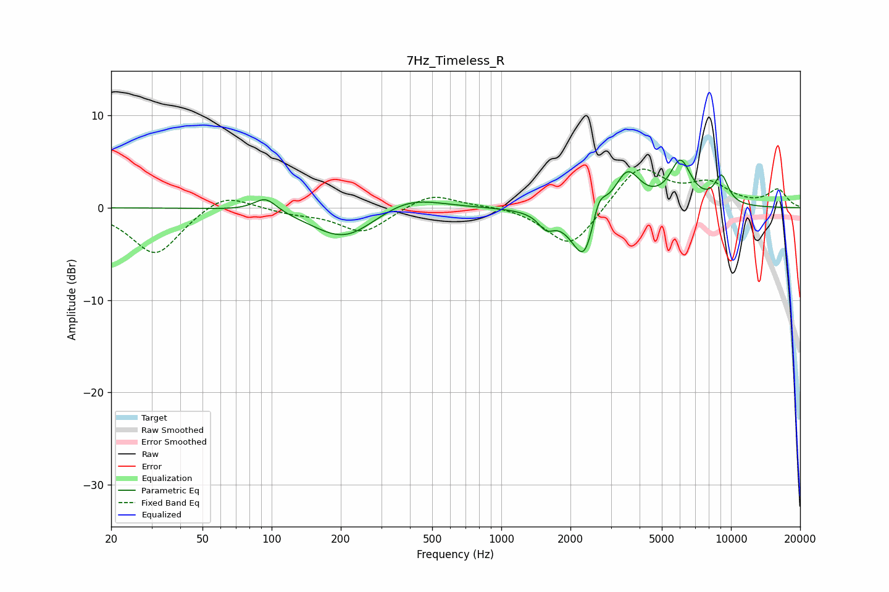

# 7Hz_Timeless_R
See [usage instructions](https://github.com/jaakkopasanen/AutoEq#usage) for more options and info.

### Parametric EQs
Apply preamp of -5.3 dB when using parametric equalizer.

|   # | Type    |   Fc (Hz) |    Q |   Gain (dB) |
|-----|---------|-----------|------|-------------|
|   1 | Peaking |        94 | 2.85 |         1.6 |
|   2 | Peaking |       207 | 1.03 |        -3.5 |
|   3 | Peaking |       393 | 1.03 |         1.6 |
|   4 | Peaking |      1568 | 4.2  |        -1.5 |
|   5 | Peaking |      2305 | 2.09 |        -4.6 |
|   6 | Peaking |      2312 | 3.7  |        -2   |
|   7 | Peaking |      2651 | 4.35 |         3.3 |
|   8 | Peaking |      3530 | 2.47 |         4.3 |
|   9 | Peaking |      6027 | 2.94 |         4.7 |
|  10 | Peaking |      9100 | 4.24 |         3   |

### Fixed Band EQs
When using fixed band (also called graphic) equalizer, apply preamp of **-4.3 dB** (if available) and set gains manually with these parameters.

|   # | Type    |   Fc (Hz) |    Q |   Gain (dB) |
|-----|---------|-----------|------|-------------|
|   1 | Peaking |        31 | 1.41 |        -5.2 |
|   2 | Peaking |        62 | 1.41 |         1.9 |
|   3 | Peaking |       125 | 1.41 |        -0.5 |
|   4 | Peaking |       250 | 1.41 |        -2.7 |
|   5 | Peaking |       500 | 1.41 |         1.7 |
|   6 | Peaking |      1000 | 1.41 |         0.3 |
|   7 | Peaking |      2000 | 1.41 |        -4.6 |
|   8 | Peaking |      4000 | 1.41 |         4.5 |
|   9 | Peaking |      8000 | 1.41 |         2.3 |
|  10 | Peaking |     16000 | 1.41 |         1.9 |

### Graphs

