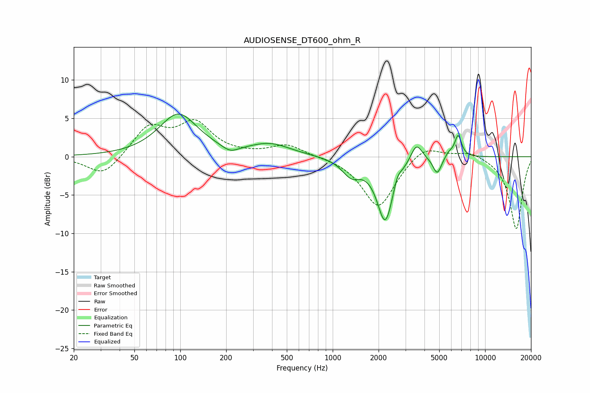

# AUDIOSENSE_DT600_ohm_R
See [usage instructions](https://github.com/jaakkopasanen/AutoEq#usage) for more options and info.

### Parametric EQs
Apply preamp of -5.6 dB when using parametric equalizer.

|   # | Type    |   Fc (Hz) |    Q |   Gain (dB) |
|-----|---------|-----------|------|-------------|
|   1 | Peaking |        97 | 1.12 |         5.5 |
|   2 | Peaking |       213 | 2.63 |        -0.9 |
|   3 | Peaking |       388 | 1.05 |         1.5 |
|   4 | Peaking |      1323 | 2.36 |        -2.1 |
|   5 | Peaking |      2211 | 2.64 |        -8.3 |
|   6 | Peaking |      2658 | 6    |         1.2 |
|   7 | Peaking |      3542 | 3.68 |         2.5 |
|   8 | Peaking |      4850 | 5.09 |        -2.2 |
|   9 | Peaking |      5774 | 5.58 |         0.7 |
|  10 | Peaking |      6654 | 6    |         2.9 |

### Fixed Band EQs
When using fixed band (also called graphic) equalizer, apply preamp of **-4.9 dB** (if available) and set gains manually with these parameters.

|   # | Type    |   Fc (Hz) |    Q |   Gain (dB) |
|-----|---------|-----------|------|-------------|
|   1 | Peaking |        31 | 1.41 |        -2.7 |
|   2 | Peaking |        62 | 1.41 |         3.8 |
|   3 | Peaking |       125 | 1.41 |         4.1 |
|   4 | Peaking |       250 | 1.41 |         0.1 |
|   5 | Peaking |       500 | 1.41 |         1.6 |
|   6 | Peaking |      1000 | 1.41 |         0   |
|   7 | Peaking |      2000 | 1.41 |        -6.7 |
|   8 | Peaking |      4000 | 1.41 |         1.8 |
|   9 | Peaking |      8000 | 1.41 |         0.8 |
|  10 | Peaking |     16000 | 1.41 |        -9.5 |

### Graphs

