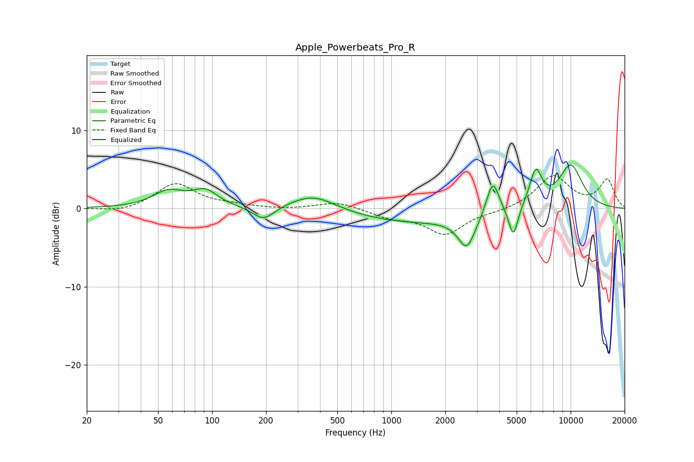

# Apple_Powerbeats_Pro_R
See [usage instructions](https://github.com/jaakkopasanen/AutoEq#usage) for more options and info.

### Parametric EQs
Apply preamp of -5.7 dB when using parametric equalizer.

|   # | Type    |   Fc (Hz) |    Q |   Gain (dB) |
|-----|---------|-----------|------|-------------|
|   1 | Peaking |        57 | 1.6  |         2   |
|   2 | Peaking |        92 | 2.05 |         2   |
|   3 | Peaking |       194 | 2.32 |        -1.8 |
|   4 | Peaking |       367 | 1.09 |         2.1 |
|   5 | Peaking |      1382 | 0.37 |        -1.8 |
|   6 | Peaking |      2632 | 2.98 |        -4   |
|   7 | Peaking |      3678 | 3.93 |         4.6 |
|   8 | Peaking |      4790 | 5.43 |        -3.9 |
|   9 | Peaking |      6388 | 3.92 |         4.6 |
|  10 | Peaking |     10000 | 1.76 |         5.5 |

### Fixed Band EQs
When using fixed band (also called graphic) equalizer, apply preamp of **-4.3 dB** (if available) and set gains manually with these parameters.

|   # | Type    |   Fc (Hz) |    Q |   Gain (dB) |
|-----|---------|-----------|------|-------------|
|   1 | Peaking |        31 | 1.41 |        -0.5 |
|   2 | Peaking |        62 | 1.41 |         3.2 |
|   3 | Peaking |       125 | 1.41 |         0.3 |
|   4 | Peaking |       250 | 1.41 |        -0.1 |
|   5 | Peaking |       500 | 1.41 |         0.9 |
|   6 | Peaking |      1000 | 1.41 |        -1   |
|   7 | Peaking |      2000 | 1.41 |        -3.2 |
|   8 | Peaking |      4000 | 1.41 |        -0.3 |
|   9 | Peaking |      8000 | 1.41 |         4.1 |
|  10 | Peaking |     16000 | 1.41 |         3.6 |

### Graphs

