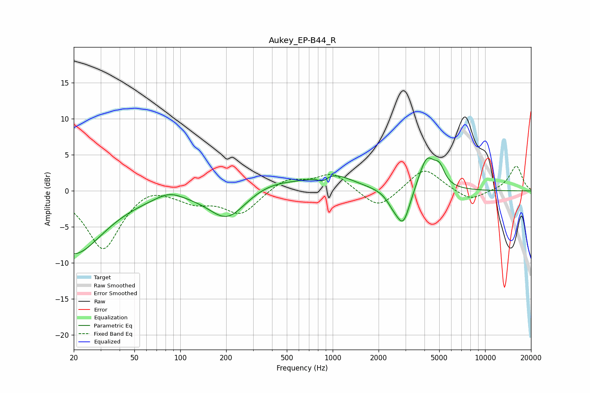

# Aukey_EP-B44_R
See [usage instructions](https://github.com/jaakkopasanen/AutoEq#usage) for more options and info.

### Parametric EQs
Apply preamp of -4.7 dB when using parametric equalizer.

|   # | Type    |   Fc (Hz) |    Q |   Gain (dB) |
|-----|---------|-----------|------|-------------|
|   1 | Peaking |        20 | 0.73 |        -8.7 |
|   2 | Peaking |        84 | 1.67 |         1   |
|   3 | Peaking |       203 | 1.17 |        -4.1 |
|   4 | Peaking |       397 | 0.82 |         1.4 |
|   5 | Peaking |       857 | 4.39 |        -0.8 |
|   6 | Peaking |       991 | 1.04 |         2.2 |
|   7 | Peaking |      2476 | 3.53 |        -1.1 |
|   8 | Peaking |      2899 | 3.03 |        -4.9 |
|   9 | Peaking |      4146 | 2.6  |         4.7 |
|  10 | Peaking |      5020 | 4.18 |         2.1 |

### Fixed Band EQs
When using fixed band (also called graphic) equalizer, apply preamp of **-3.5 dB** (if available) and set gains manually with these parameters.

|   # | Type    |   Fc (Hz) |    Q |   Gain (dB) |
|-----|---------|-----------|------|-------------|
|   1 | Peaking |        31 | 1.41 |        -8.1 |
|   2 | Peaking |        62 | 1.41 |         1.2 |
|   3 | Peaking |       125 | 1.41 |        -1.4 |
|   4 | Peaking |       250 | 1.41 |        -3.2 |
|   5 | Peaking |       500 | 1.41 |         1.7 |
|   6 | Peaking |      1000 | 1.41 |         2.4 |
|   7 | Peaking |      2000 | 1.41 |        -2.7 |
|   8 | Peaking |      4000 | 1.41 |         3.3 |
|   9 | Peaking |      8000 | 1.41 |        -1.5 |
|  10 | Peaking |     16000 | 1.41 |         3.5 |

### Graphs

