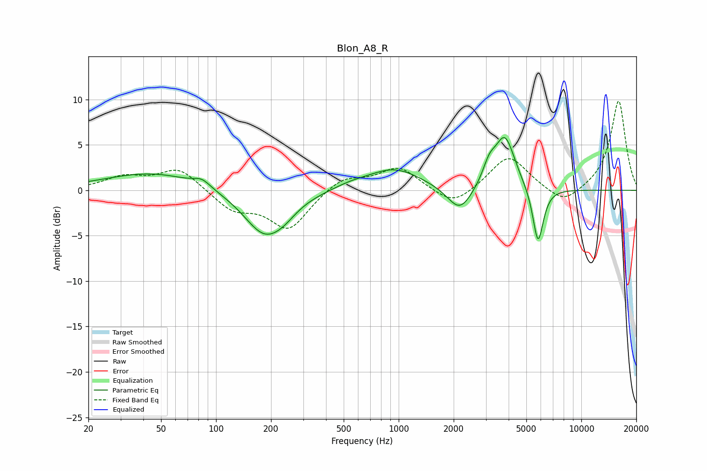

# Blon_A8_R
See [usage instructions](https://github.com/jaakkopasanen/AutoEq#usage) for more options and info.

### Parametric EQs
Apply preamp of -5.9 dB when using parametric equalizer.

|   # | Type    |   Fc (Hz) |    Q |   Gain (dB) |
|-----|---------|-----------|------|-------------|
|   1 | Peaking |        45 | 0.54 |         2   |
|   2 | Peaking |        84 | 3.15 |         0.8 |
|   3 | Peaking |       185 | 1.22 |        -4.9 |
|   4 | Peaking |       236 | 2.06 |        -0.8 |
|   5 | Peaking |       544 | 1.49 |         0.4 |
|   6 | Peaking |       946 | 0.95 |         2.4 |
|   7 | Peaking |      2163 | 2.08 |        -2.9 |
|   8 | Peaking |      3131 | 3.95 |         1.9 |
|   9 | Peaking |      3815 | 2.53 |         5.8 |
|  10 | Peaking |      5794 | 4.72 |        -6.3 |

### Fixed Band EQs
When using fixed band (also called graphic) equalizer, apply preamp of **-9.9 dB** (if available) and set gains manually with these parameters.

|   # | Type    |   Fc (Hz) |    Q |   Gain (dB) |
|-----|---------|-----------|------|-------------|
|   1 | Peaking |        31 | 1.41 |         1.4 |
|   2 | Peaking |        62 | 1.41 |         2.4 |
|   3 | Peaking |       125 | 1.41 |        -2.1 |
|   4 | Peaking |       250 | 1.41 |        -4.2 |
|   5 | Peaking |       500 | 1.41 |         1.5 |
|   6 | Peaking |      1000 | 1.41 |         2.5 |
|   7 | Peaking |      2000 | 1.41 |        -2   |
|   8 | Peaking |      4000 | 1.41 |         3.9 |
|   9 | Peaking |      8000 | 1.41 |        -1.8 |
|  10 | Peaking |     16000 | 1.41 |         9.9 |

### Graphs

