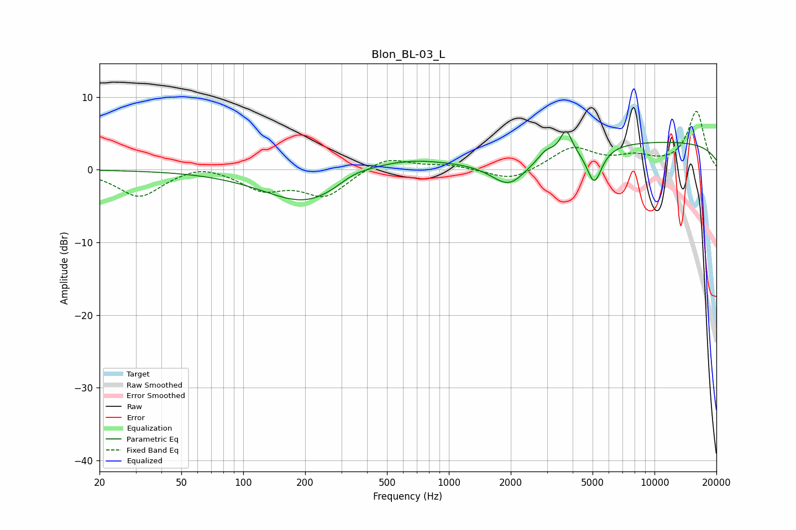

# Blon_BL-03_L
See [usage instructions](https://github.com/jaakkopasanen/AutoEq#usage) for more options and info.

### Parametric EQs
Apply preamp of -5.4 dB when using parametric equalizer.

|   # | Type    |   Fc (Hz) |    Q |   Gain (dB) |
|-----|---------|-----------|------|-------------|
|   1 | Peaking |       207 | 0.68 |        -4.9 |
|   2 | Peaking |       342 | 1.69 |         1   |
|   3 | Peaking |       554 | 0.67 |         2.1 |
|   4 | Peaking |       605 | 5.07 |        -0   |
|   5 | Peaking |      1964 | 1.61 |        -3.8 |
|   6 | Peaking |      2961 | 4.01 |         1   |
|   7 | Peaking |      3714 | 5.02 |         3.3 |
|   8 | Peaking |      5102 | 3.73 |        -5.1 |
|   9 | Peaking |      5405 | 5.64 |         0.1 |
|  10 | Peaking |     10000 | 0.18 |         3.9 |

### Fixed Band EQs
When using fixed band (also called graphic) equalizer, apply preamp of **-8.1 dB** (if available) and set gains manually with these parameters.

|   # | Type    |   Fc (Hz) |    Q |   Gain (dB) |
|-----|---------|-----------|------|-------------|
|   1 | Peaking |        31 | 1.41 |        -3.7 |
|   2 | Peaking |        62 | 1.41 |         1   |
|   3 | Peaking |       125 | 1.41 |        -2.5 |
|   4 | Peaking |       250 | 1.41 |        -3.6 |
|   5 | Peaking |       500 | 1.41 |         1.9 |
|   6 | Peaking |      1000 | 1.41 |         0.6 |
|   7 | Peaking |      2000 | 1.41 |        -1.6 |
|   8 | Peaking |      4000 | 1.41 |         3   |
|   9 | Peaking |      8000 | 1.41 |         1.5 |
|  10 | Peaking |     16000 | 1.41 |         8   |

### Graphs

