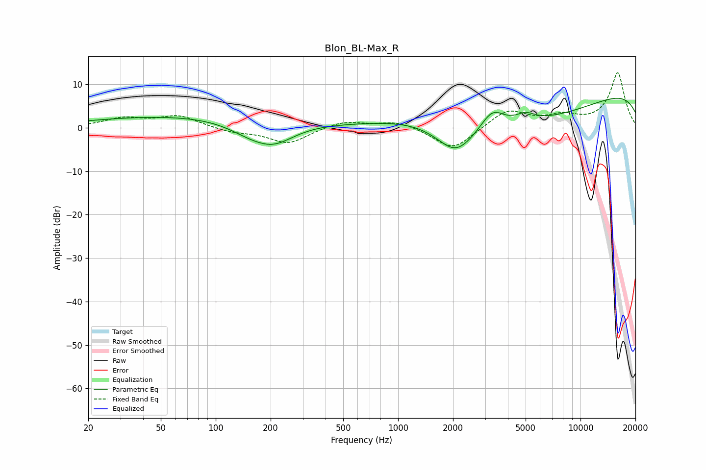

# Blon_BL-Max_R
See [usage instructions](https://github.com/jaakkopasanen/AutoEq#usage) for more options and info.

### Parametric EQs
Apply preamp of -6.9 dB when using parametric equalizer.

|   # | Type    |   Fc (Hz) |    Q |   Gain (dB) |
|-----|---------|-----------|------|-------------|
|   1 | Peaking |        78 | 0.24 |         2.9 |
|   2 | Peaking |       153 | 1.14 |        -2.3 |
|   3 | Peaking |       200 | 0.76 |         0.2 |
|   4 | Peaking |       208 | 1.17 |        -4.9 |
|   5 | Peaking |      1555 | 0.47 |         5.3 |
|   6 | Peaking |      2068 | 1.25 |        -7.9 |
|   7 | Peaking |      3283 | 2.17 |         4.7 |
|   8 | Peaking |      4297 | 0.27 |        -9.5 |
|   9 | Peaking |      5001 | 2.7  |         1.9 |
|  10 | Peaking |     10000 | 0.18 |        10.8 |

### Fixed Band EQs
When using fixed band (also called graphic) equalizer, apply preamp of **-12.7 dB** (if available) and set gains manually with these parameters.

|   # | Type    |   Fc (Hz) |    Q |   Gain (dB) |
|-----|---------|-----------|------|-------------|
|   1 | Peaking |        31 | 1.41 |         2   |
|   2 | Peaking |        62 | 1.41 |         2.7 |
|   3 | Peaking |       125 | 1.41 |        -1   |
|   4 | Peaking |       250 | 1.41 |        -3.6 |
|   5 | Peaking |       500 | 1.41 |         1.6 |
|   6 | Peaking |      1000 | 1.41 |         1.6 |
|   7 | Peaking |      2000 | 1.41 |        -5.3 |
|   8 | Peaking |      4000 | 1.41 |         4.1 |
|   9 | Peaking |      8000 | 1.41 |         2.2 |
|  10 | Peaking |     16000 | 1.41 |        12.6 |

### Graphs

