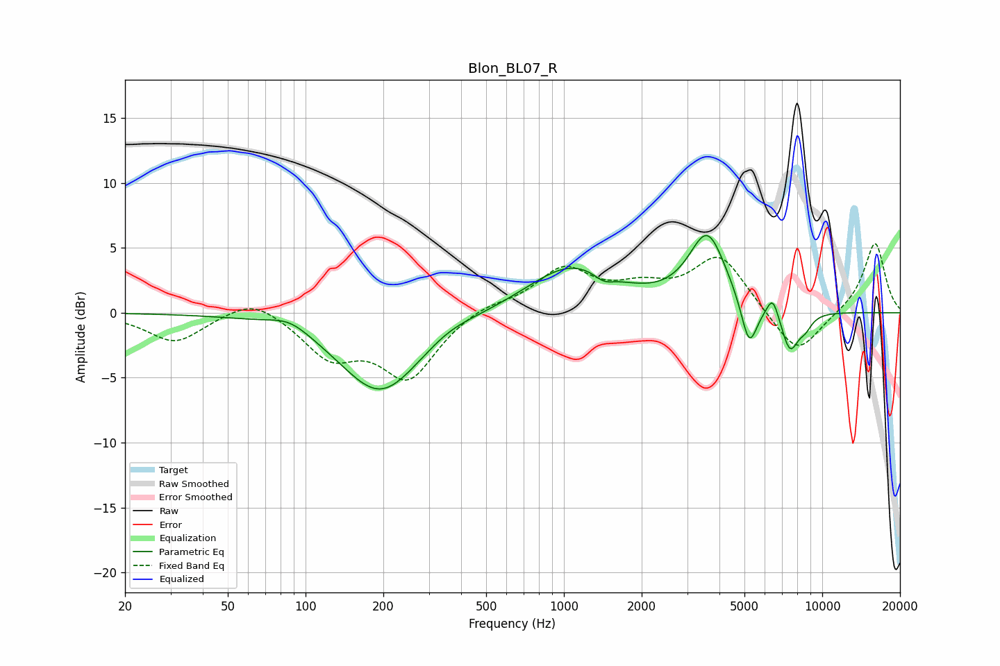

# Blon_BL07_R
See [usage instructions](https://github.com/jaakkopasanen/AutoEq#usage) for more options and info.

### Parametric EQs
Apply preamp of -6.0 dB when using parametric equalizer.

|   # | Type    |   Fc (Hz) |    Q |   Gain (dB) |
|-----|---------|-----------|------|-------------|
|   1 | Peaking |        87 | 1.78 |         0.9 |
|   2 | Peaking |       195 | 0.89 |        -6.2 |
|   3 | Peaking |       359 | 1.52 |         0.5 |
|   4 | Peaking |      1069 | 0.83 |         3.6 |
|   5 | Peaking |      1428 | 3.69 |        -0.7 |
|   6 | Peaking |      3595 | 1.94 |         5.8 |
|   7 | Peaking |      5214 | 4.4  |        -3.7 |
|   8 | Peaking |      6433 | 5.99 |         1.6 |
|   9 | Peaking |      7504 | 3.92 |        -3.1 |
|  10 | Peaking |      8596 | 4.73 |        -0.8 |

### Fixed Band EQs
When using fixed band (also called graphic) equalizer, apply preamp of **-5.4 dB** (if available) and set gains manually with these parameters.

|   # | Type    |   Fc (Hz) |    Q |   Gain (dB) |
|-----|---------|-----------|------|-------------|
|   1 | Peaking |        31 | 1.41 |        -2.3 |
|   2 | Peaking |        62 | 1.41 |         1.4 |
|   3 | Peaking |       125 | 1.41 |        -3.1 |
|   4 | Peaking |       250 | 1.41 |        -4.9 |
|   5 | Peaking |       500 | 1.41 |         0.7 |
|   6 | Peaking |      1000 | 1.41 |         3.2 |
|   7 | Peaking |      2000 | 1.41 |         1.5 |
|   8 | Peaking |      4000 | 1.41 |         4.3 |
|   9 | Peaking |      8000 | 1.41 |        -3.5 |
|  10 | Peaking |     16000 | 1.41 |         5.5 |

### Graphs

