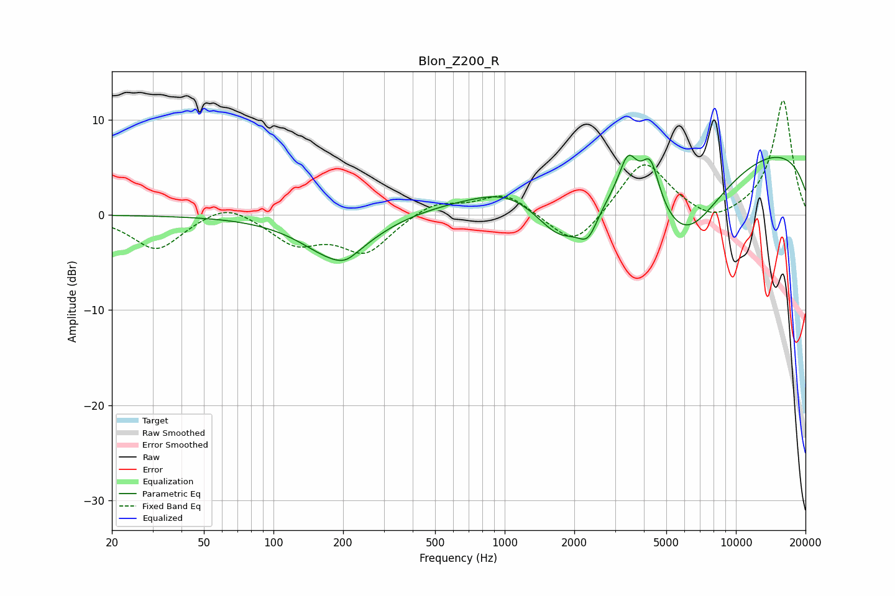

# Blon_Z200_R
See [usage instructions](https://github.com/jaakkopasanen/AutoEq#usage) for more options and info.

### Parametric EQs
Apply preamp of -6.4 dB when using parametric equalizer.

|   # | Type    |   Fc (Hz) |    Q |   Gain (dB) |
|-----|---------|-----------|------|-------------|
|   1 | Peaking |       190 | 0.96 |        -4.7 |
|   2 | Peaking |       205 | 3.18 |        -0.6 |
|   3 | Peaking |      1039 | 1.05 |         1.2 |
|   4 | Peaking |      1389 | 0.25 |         1.7 |
|   5 | Peaking |      1754 | 1.2  |        -5.6 |
|   6 | Peaking |      2296 | 3.21 |        -2.9 |
|   7 | Peaking |      3416 | 3.57 |         4.3 |
|   8 | Peaking |      4272 | 3.63 |         4.8 |
|   9 | Peaking |      5973 | 0.77 |        -9.7 |
|  10 | Peaking |      9727 | 0.18 |         8   |

### Fixed Band EQs
When using fixed band (also called graphic) equalizer, apply preamp of **-12.1 dB** (if available) and set gains manually with these parameters.

|   # | Type    |   Fc (Hz) |    Q |   Gain (dB) |
|-----|---------|-----------|------|-------------|
|   1 | Peaking |        31 | 1.41 |        -3.7 |
|   2 | Peaking |        62 | 1.41 |         1.6 |
|   3 | Peaking |       125 | 1.41 |        -2.8 |
|   4 | Peaking |       250 | 1.41 |        -3.8 |
|   5 | Peaking |       500 | 1.41 |         1.5 |
|   6 | Peaking |      1000 | 1.41 |         2.3 |
|   7 | Peaking |      2000 | 1.41 |        -3.7 |
|   8 | Peaking |      4000 | 1.41 |         5.9 |
|   9 | Peaking |      8000 | 1.41 |        -1.3 |
|  10 | Peaking |     16000 | 1.41 |        12.1 |

### Graphs

