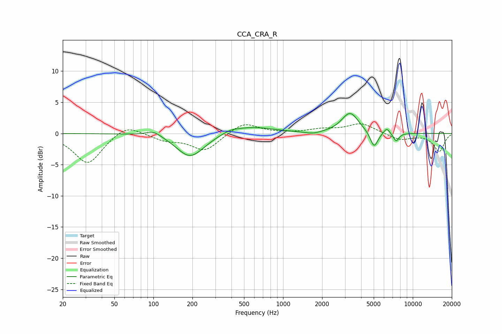

# CCA_CRA_R
See [usage instructions](https://github.com/jaakkopasanen/AutoEq#usage) for more options and info.

### Parametric EQs
Apply preamp of -3.3 dB when using parametric equalizer.

|   # | Type    |   Fc (Hz) |    Q |   Gain (dB) |
|-----|---------|-----------|------|-------------|
|   1 | Peaking |       100 | 2.35 |         0.9 |
|   2 | Peaking |       189 | 1.39 |        -3.4 |
|   3 | Peaking |       228 | 1.3  |        -0.5 |
|   4 | Peaking |       391 | 2.26 |         0.4 |
|   5 | Peaking |       564 | 0.82 |         1.1 |
|   6 | Peaking |      1700 | 2.4  |        -0.4 |
|   7 | Peaking |      3286 | 2.17 |         3.3 |
|   8 | Peaking |      5031 | 4.67 |        -2.6 |
|   9 | Peaking |      6295 | 6    |         1   |
|  10 | Peaking |      7449 | 5.98 |        -1.3 |

### Fixed Band EQs
When using fixed band (also called graphic) equalizer, apply preamp of **-1.7 dB** (if available) and set gains manually with these parameters.

|   # | Type    |   Fc (Hz) |    Q |   Gain (dB) |
|-----|---------|-----------|------|-------------|
|   1 | Peaking |        31 | 1.41 |        -4.9 |
|   2 | Peaking |        62 | 1.41 |         1.7 |
|   3 | Peaking |       125 | 1.41 |        -1   |
|   4 | Peaking |       250 | 1.41 |        -2.7 |
|   5 | Peaking |       500 | 1.41 |         1.9 |
|   6 | Peaking |      1000 | 1.41 |         0   |
|   7 | Peaking |      2000 | 1.41 |         0.6 |
|   8 | Peaking |      4000 | 1.41 |         1.6 |
|   9 | Peaking |      8000 | 1.41 |        -1   |
|  10 | Peaking |     16000 | 1.41 |        -2.9 |

### Graphs

