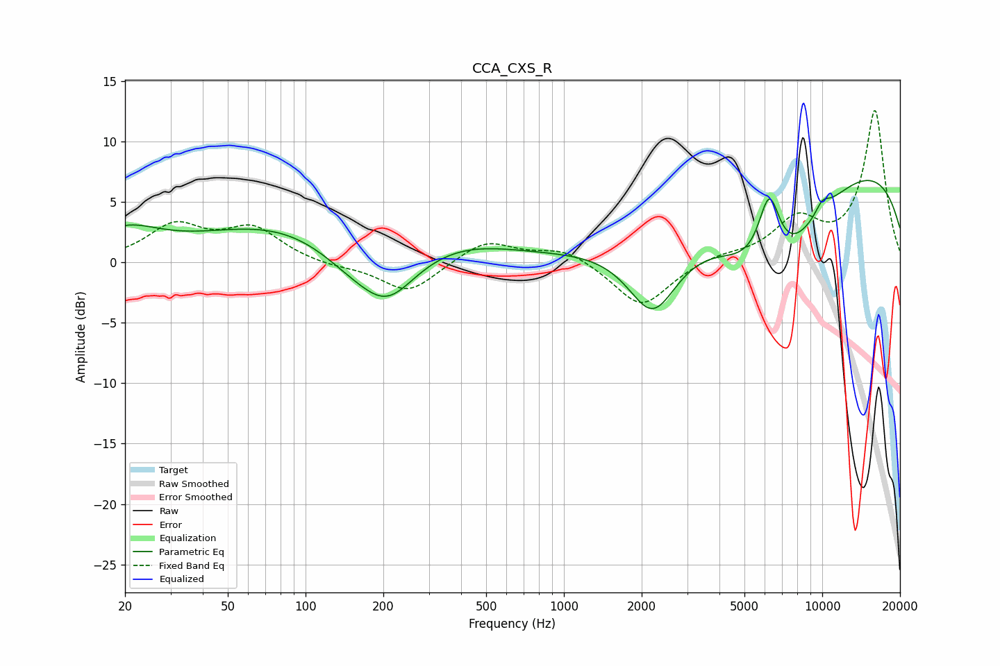

# CCA_CXS_R
See [usage instructions](https://github.com/jaakkopasanen/AutoEq#usage) for more options and info.

### Parametric EQs
Apply preamp of -6.9 dB when using parametric equalizer.

|   # | Type    |   Fc (Hz) |    Q |   Gain (dB) |
|-----|---------|-----------|------|-------------|
|   1 | Peaking |        20 | 1.06 |         2.3 |
|   2 | Peaking |        87 | 0.44 |         3.4 |
|   3 | Peaking |       151 | 0.94 |        -2.2 |
|   4 | Peaking |       208 | 1.27 |        -3.9 |
|   5 | Peaking |       409 | 0.68 |         1.3 |
|   6 | Peaking |      2208 | 1.43 |        -6.3 |
|   7 | Peaking |      6233 | 3.06 |         6.4 |
|   8 | Peaking |      6403 | 0.69 |        -9.4 |
|   9 | Peaking |     10000 | 4.3  |         1   |
|  10 | Peaking |     10000 | 0.2  |         9.3 |

### Fixed Band EQs
When using fixed band (also called graphic) equalizer, apply preamp of **-12.7 dB** (if available) and set gains manually with these parameters.

|   # | Type    |   Fc (Hz) |    Q |   Gain (dB) |
|-----|---------|-----------|------|-------------|
|   1 | Peaking |        31 | 1.41 |         2.9 |
|   2 | Peaking |        62 | 1.41 |         2.7 |
|   3 | Peaking |       125 | 1.41 |        -0.3 |
|   4 | Peaking |       250 | 1.41 |        -2.6 |
|   5 | Peaking |       500 | 1.41 |         1.9 |
|   6 | Peaking |      1000 | 1.41 |         1.2 |
|   7 | Peaking |      2000 | 1.41 |        -3.8 |
|   8 | Peaking |      4000 | 1.41 |         0.5 |
|   9 | Peaking |      8000 | 1.41 |         3.3 |
|  10 | Peaking |     16000 | 1.41 |        12.5 |

### Graphs

