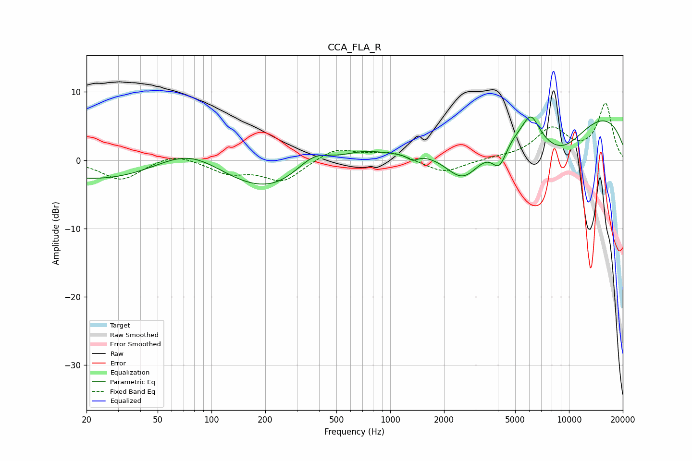

# CCA_FLA_R
See [usage instructions](https://github.com/jaakkopasanen/AutoEq#usage) for more options and info.

### Parametric EQs
Apply preamp of -6.4 dB when using parametric equalizer.

|   # | Type    |   Fc (Hz) |    Q |   Gain (dB) |
|-----|---------|-----------|------|-------------|
|   1 | Peaking |        76 | 0.44 |        12.3 |
|   2 | Peaking |       109 | 0.18 |       -12.7 |
|   3 | Peaking |       374 | 1.11 |         5.2 |
|   4 | Peaking |       686 | 0.93 |         3.3 |
|   5 | Peaking |      1334 | 4.93 |        -0.9 |
|   6 | Peaking |      2575 | 1.15 |        -7.7 |
|   7 | Peaking |      4080 | 3.24 |        -3.9 |
|   8 | Peaking |      6126 | 3.07 |         3.4 |
|   9 | Peaking |      8205 | 0.18 |         9.9 |
|  10 | Peaking |      8866 | 0.73 |        -7.5 |

### Fixed Band EQs
When using fixed band (also called graphic) equalizer, apply preamp of **-8.4 dB** (if available) and set gains manually with these parameters.

|   # | Type    |   Fc (Hz) |    Q |   Gain (dB) |
|-----|---------|-----------|------|-------------|
|   1 | Peaking |        31 | 1.41 |        -2.9 |
|   2 | Peaking |        62 | 1.41 |         1.2 |
|   3 | Peaking |       125 | 1.41 |        -1.8 |
|   4 | Peaking |       250 | 1.41 |        -3   |
|   5 | Peaking |       500 | 1.41 |         1.8 |
|   6 | Peaking |      1000 | 1.41 |         1.2 |
|   7 | Peaking |      2000 | 1.41 |        -1.9 |
|   8 | Peaking |      4000 | 1.41 |         0.2 |
|   9 | Peaking |      8000 | 1.41 |         4.4 |
|  10 | Peaking |     16000 | 1.41 |         8.2 |

### Graphs

