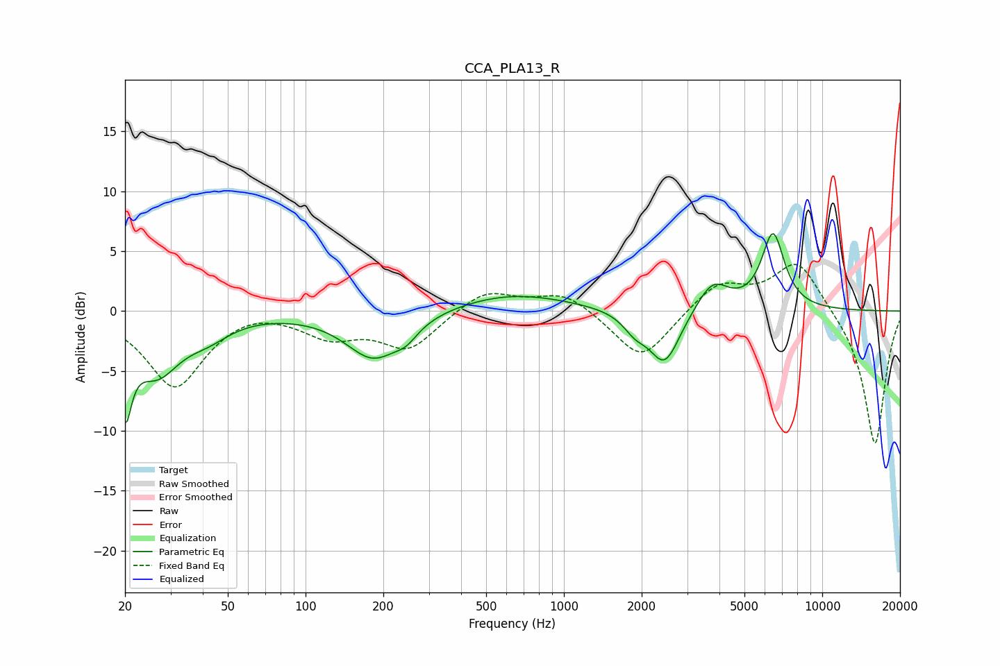

# CCA_PLA13_R
See [usage instructions](https://github.com/jaakkopasanen/AutoEq#usage) for more options and info.

### Parametric EQs
Apply preamp of -6.5 dB when using parametric equalizer.

|   # | Type    |   Fc (Hz) |    Q |   Gain (dB) |
|-----|---------|-----------|------|-------------|
|   1 | Peaking |        20 | 5.72 |        -6.5 |
|   2 | Peaking |        26 | 1.53 |        -4.8 |
|   3 | Peaking |        42 | 1.63 |        -1.3 |
|   4 | Peaking |       183 | 1.31 |        -4   |
|   5 | Peaking |       246 | 3.18 |        -0.9 |
|   6 | Peaking |       629 | 0.62 |         1.5 |
|   7 | Peaking |      1885 | 3.15 |        -1.3 |
|   8 | Peaking |      2454 | 2.35 |        -4.6 |
|   9 | Peaking |      3762 | 2.26 |         2.5 |
|  10 | Peaking |      6449 | 3.09 |         6.3 |

### Fixed Band EQs
When using fixed band (also called graphic) equalizer, apply preamp of **-4.0 dB** (if available) and set gains manually with these parameters.

|   # | Type    |   Fc (Hz) |    Q |   Gain (dB) |
|-----|---------|-----------|------|-------------|
|   1 | Peaking |        31 | 1.41 |        -6.3 |
|   2 | Peaking |        62 | 1.41 |         0.5 |
|   3 | Peaking |       125 | 1.41 |        -1.9 |
|   4 | Peaking |       250 | 1.41 |        -3.1 |
|   5 | Peaking |       500 | 1.41 |         1.8 |
|   6 | Peaking |      1000 | 1.41 |         1.6 |
|   7 | Peaking |      2000 | 1.41 |        -4.2 |
|   8 | Peaking |      4000 | 1.41 |         2.4 |
|   9 | Peaking |      8000 | 1.41 |         4.3 |
|  10 | Peaking |     16000 | 1.41 |       -11.3 |

### Graphs

