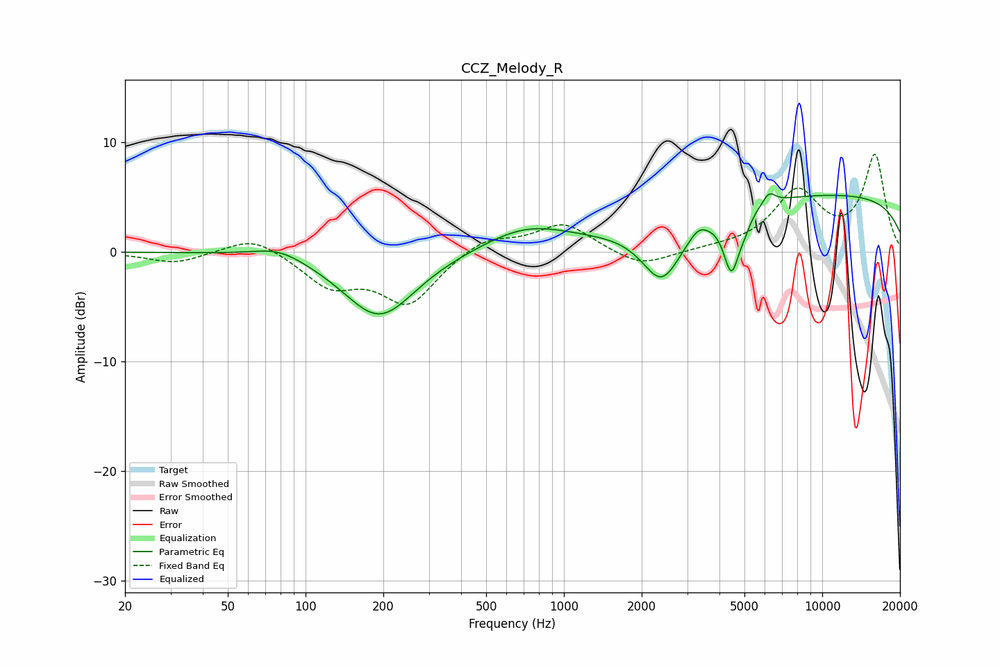

# CCZ_Melody_R
See [usage instructions](https://github.com/jaakkopasanen/AutoEq#usage) for more options and info.

### Parametric EQs
Apply preamp of -5.4 dB when using parametric equalizer.

|   # | Type    |   Fc (Hz) |    Q |   Gain (dB) |
|-----|---------|-----------|------|-------------|
|   1 | Peaking |        79 | 1.41 |         1   |
|   2 | Peaking |       180 | 1.18 |        -0.4 |
|   3 | Peaking |       195 | 1.01 |        -5.6 |
|   4 | Peaking |       715 | 0.84 |         2.2 |
|   5 | Peaking |      2398 | 1.81 |        -5.4 |
|   6 | Peaking |      3314 | 4.41 |         0.7 |
|   7 | Peaking |      4455 | 4.57 |        -5.4 |
|   8 | Peaking |      5013 | 5.98 |        -0.9 |
|   9 | Peaking |      6224 | 5.53 |         1.1 |
|  10 | Peaking |     10000 | 0.18 |         5.3 |

### Fixed Band EQs
When using fixed band (also called graphic) equalizer, apply preamp of **-9.0 dB** (if available) and set gains manually with these parameters.

|   # | Type    |   Fc (Hz) |    Q |   Gain (dB) |
|-----|---------|-----------|------|-------------|
|   1 | Peaking |        31 | 1.41 |        -1   |
|   2 | Peaking |        62 | 1.41 |         1.6 |
|   3 | Peaking |       125 | 1.41 |        -2.9 |
|   4 | Peaking |       250 | 1.41 |        -4.6 |
|   5 | Peaking |       500 | 1.41 |         1.4 |
|   6 | Peaking |      1000 | 1.41 |         2.6 |
|   7 | Peaking |      2000 | 1.41 |        -1.5 |
|   8 | Peaking |      4000 | 1.41 |         0.2 |
|   9 | Peaking |      8000 | 1.41 |         5.3 |
|  10 | Peaking |     16000 | 1.41 |         8.7 |

### Graphs

