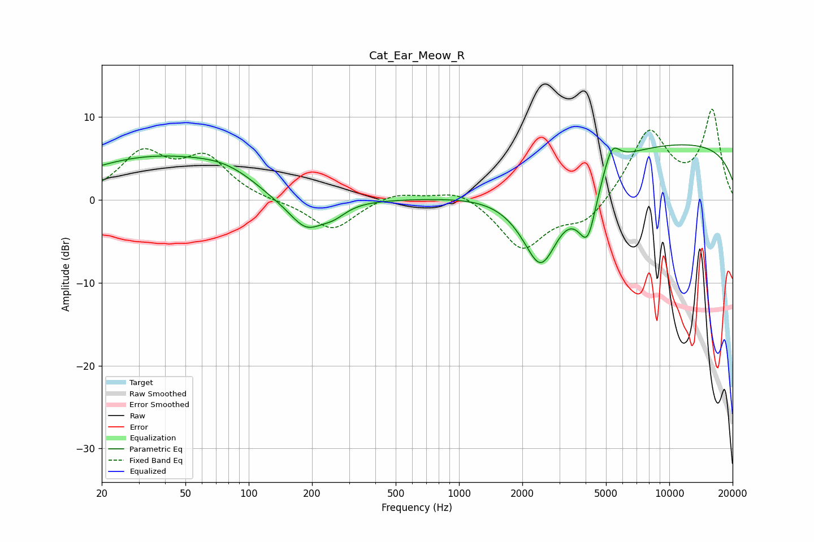

# Cat_Ear_Meow_R
See [usage instructions](https://github.com/jaakkopasanen/AutoEq#usage) for more options and info.

### Parametric EQs
Apply preamp of -6.7 dB when using parametric equalizer.

|   # | Type    |   Fc (Hz) |    Q |   Gain (dB) |
|-----|---------|-----------|------|-------------|
|   1 | Peaking |        34 | 0.4  |         4.8 |
|   2 | Peaking |        79 | 0.87 |         1.8 |
|   3 | Peaking |       131 | 1.18 |        -0.8 |
|   4 | Peaking |       188 | 1.69 |        -3.7 |
|   5 | Peaking |       253 | 2.32 |        -1.3 |
|   6 | Peaking |      2454 | 1.45 |       -10.9 |
|   7 | Peaking |      3926 | 2.23 |        -2.6 |
|   8 | Peaking |      4113 | 3.57 |        -4.8 |
|   9 | Peaking |      5331 | 3.74 |         3   |
|  10 | Peaking |      9957 | 0.18 |         6.9 |

### Fixed Band EQs
When using fixed band (also called graphic) equalizer, apply preamp of **-11.0 dB** (if available) and set gains manually with these parameters.

|   # | Type    |   Fc (Hz) |    Q |   Gain (dB) |
|-----|---------|-----------|------|-------------|
|   1 | Peaking |        31 | 1.41 |         5.3 |
|   2 | Peaking |        62 | 1.41 |         4.7 |
|   3 | Peaking |       125 | 1.41 |        -0.2 |
|   4 | Peaking |       250 | 1.41 |        -3.7 |
|   5 | Peaking |       500 | 1.41 |         1   |
|   6 | Peaking |      1000 | 1.41 |         1.4 |
|   7 | Peaking |      2000 | 1.41 |        -5.9 |
|   8 | Peaking |      4000 | 1.41 |        -2.8 |
|   9 | Peaking |      8000 | 1.41 |         8.3 |
|  10 | Peaking |     16000 | 1.41 |        10.6 |

### Graphs

