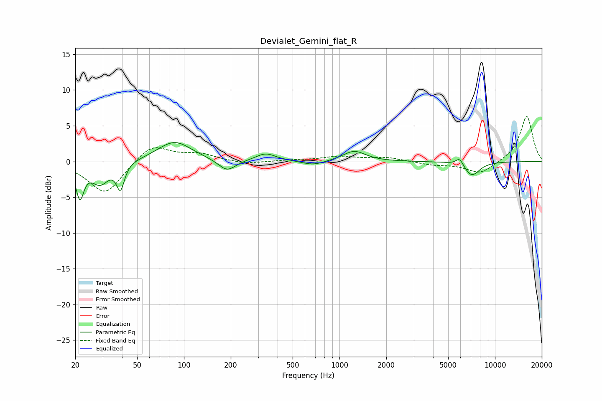

# Devialet_Gemini_flat_R
See [usage instructions](https://github.com/jaakkopasanen/AutoEq#usage) for more options and info.

### Parametric EQs
Apply preamp of -2.7 dB when using parametric equalizer.

|   # | Type    |   Fc (Hz) |    Q |   Gain (dB) |
|-----|---------|-----------|------|-------------|
|   1 | Peaking |        21 | 5.7  |        -4.5 |
|   2 | Peaking |        29 | 2.5  |        -3   |
|   3 | Peaking |        39 | 5.83 |        -3.5 |
|   4 | Peaking |        87 | 1.3  |         2.8 |
|   5 | Peaking |       189 | 2.53 |        -1.7 |
|   6 | Peaking |       336 | 2.18 |         1.1 |
|   7 | Peaking |       678 | 2.01 |        -0.6 |
|   8 | Peaking |      1245 | 1.98 |         1.5 |
|   9 | Peaking |      5924 | 5.65 |         1.1 |
|  10 | Peaking |      7094 | 2.68 |        -2   |

### Fixed Band EQs
When using fixed band (also called graphic) equalizer, apply preamp of **-6.4 dB** (if available) and set gains manually with these parameters.

|   # | Type    |   Fc (Hz) |    Q |   Gain (dB) |
|-----|---------|-----------|------|-------------|
|   1 | Peaking |        31 | 1.41 |        -4.6 |
|   2 | Peaking |        62 | 1.41 |         2.5 |
|   3 | Peaking |       125 | 1.41 |         1   |
|   4 | Peaking |       250 | 1.41 |        -0.4 |
|   5 | Peaking |       500 | 1.41 |         0.2 |
|   6 | Peaking |      1000 | 1.41 |         0.7 |
|   7 | Peaking |      2000 | 1.41 |         0.5 |
|   8 | Peaking |      4000 | 1.41 |        -0.4 |
|   9 | Peaking |      8000 | 1.41 |        -1.8 |
|  10 | Peaking |     16000 | 1.41 |         6.4 |

### Graphs

