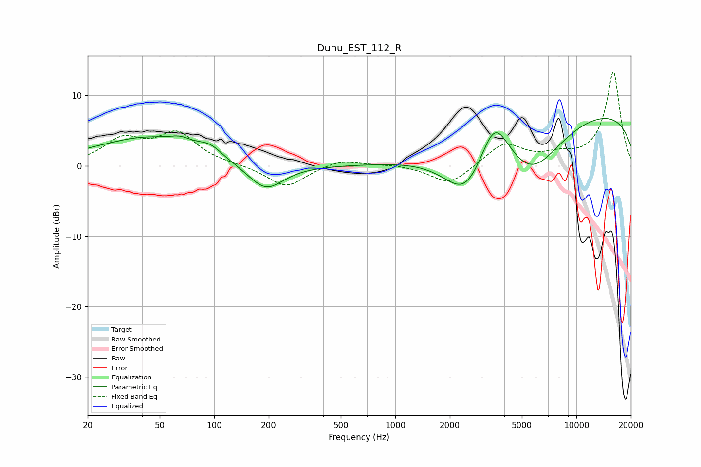

# Dunu_EST_112_R
See [usage instructions](https://github.com/jaakkopasanen/AutoEq#usage) for more options and info.

### Parametric EQs
Apply preamp of -6.8 dB when using parametric equalizer.

|   # | Type    |   Fc (Hz) |    Q |   Gain (dB) |
|-----|---------|-----------|------|-------------|
|   1 | Peaking |        20 | 1.65 |         0.3 |
|   2 | Peaking |        42 | 0.54 |         3.9 |
|   3 | Peaking |        65 | 2.44 |         0.9 |
|   4 | Peaking |        94 | 2.01 |         1.5 |
|   5 | Peaking |       118 | 5.54 |        -0   |
|   6 | Peaking |       192 | 1.42 |        -3.8 |
|   7 | Peaking |      2456 | 1.13 |        -7.4 |
|   8 | Peaking |      3527 | 1.7  |         7.2 |
|   9 | Peaking |      5636 | 0.81 |        -7.8 |
|  10 | Peaking |      9940 | 0.18 |         8.1 |

### Fixed Band EQs
When using fixed band (also called graphic) equalizer, apply preamp of **-13.3 dB** (if available) and set gains manually with these parameters.

|   # | Type    |   Fc (Hz) |    Q |   Gain (dB) |
|-----|---------|-----------|------|-------------|
|   1 | Peaking |        31 | 1.41 |         3.5 |
|   2 | Peaking |        62 | 1.41 |         4.4 |
|   3 | Peaking |       125 | 1.41 |         0.1 |
|   4 | Peaking |       250 | 1.41 |        -3.1 |
|   5 | Peaking |       500 | 1.41 |         1   |
|   6 | Peaking |      1000 | 1.41 |         0.2 |
|   7 | Peaking |      2000 | 1.41 |        -2.8 |
|   8 | Peaking |      4000 | 1.41 |         3.2 |
|   9 | Peaking |      8000 | 1.41 |         1.1 |
|  10 | Peaking |     16000 | 1.41 |        13.3 |

### Graphs

