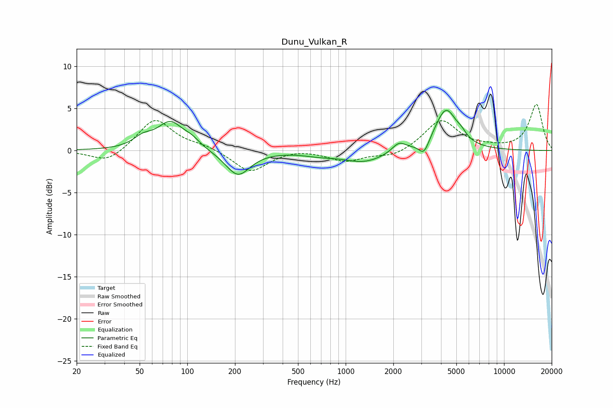

# Dunu_Vulkan_R
See [usage instructions](https://github.com/jaakkopasanen/AutoEq#usage) for more options and info.

### Parametric EQs
Apply preamp of -4.9 dB when using parametric equalizer.

|   # | Type    |   Fc (Hz) |    Q |   Gain (dB) |
|-----|---------|-----------|------|-------------|
|   1 | Peaking |        52 | 2.33 |         1.1 |
|   2 | Peaking |        78 | 1.75 |         3.2 |
|   3 | Peaking |       107 | 2.67 |         0.8 |
|   4 | Peaking |       209 | 1.82 |        -3   |
|   5 | Peaking |       677 | 1.41 |        -0.4 |
|   6 | Peaking |      1311 | 1.05 |        -1.4 |
|   7 | Peaking |      2169 | 3.3  |         1.1 |
|   8 | Peaking |      3124 | 4.45 |        -1.6 |
|   9 | Peaking |      4299 | 2.02 |         4.9 |
|  10 | Peaking |      5392 | 4.94 |         0.5 |

### Fixed Band EQs
When using fixed band (also called graphic) equalizer, apply preamp of **-5.6 dB** (if available) and set gains manually with these parameters.

|   # | Type    |   Fc (Hz) |    Q |   Gain (dB) |
|-----|---------|-----------|------|-------------|
|   1 | Peaking |        31 | 1.41 |        -1.5 |
|   2 | Peaking |        62 | 1.41 |         3.8 |
|   3 | Peaking |       125 | 1.41 |         0.5 |
|   4 | Peaking |       250 | 1.41 |        -2.6 |
|   5 | Peaking |       500 | 1.41 |         0.3 |
|   6 | Peaking |      1000 | 1.41 |        -1.2 |
|   7 | Peaking |      2000 | 1.41 |        -0.8 |
|   8 | Peaking |      4000 | 1.41 |         3.6 |
|   9 | Peaking |      8000 | 1.41 |         0.2 |
|  10 | Peaking |     16000 | 1.41 |         5.5 |

### Graphs

