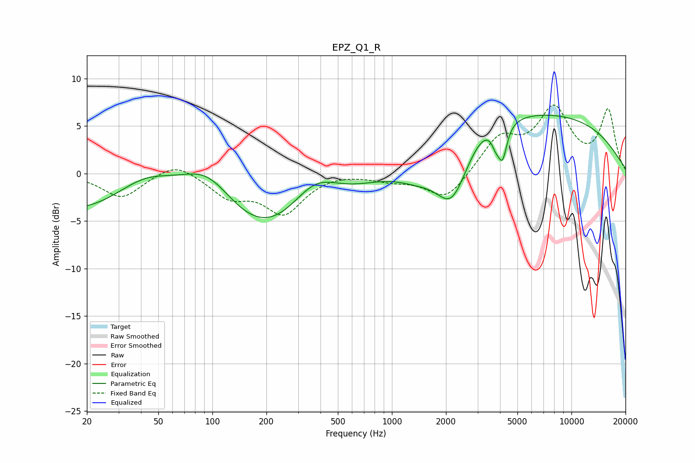

# EPZ_Q1_R
See [usage instructions](https://github.com/jaakkopasanen/AutoEq#usage) for more options and info.

### Parametric EQs
Apply preamp of -6.2 dB when using parametric equalizer.

|   # | Type    |   Fc (Hz) |    Q |   Gain (dB) |
|-----|---------|-----------|------|-------------|
|   1 | Peaking |        42 | 0.56 |         8.6 |
|   2 | Peaking |        84 | 0.18 |       -14.3 |
|   3 | Peaking |        94 | 0.68 |         9   |
|   4 | Peaking |       371 | 0.93 |         5.1 |
|   5 | Peaking |      1404 | 1    |        -2.6 |
|   6 | Peaking |      2162 | 1.49 |        -6.6 |
|   7 | Peaking |      3320 | 1.46 |         1   |
|   8 | Peaking |      3784 | 5.96 |        -1.4 |
|   9 | Peaking |      4132 | 5.72 |        -3.5 |
|  10 | Peaking |      4934 | 0.18 |         6.7 |

### Fixed Band EQs
When using fixed band (also called graphic) equalizer, apply preamp of **-7.3 dB** (if available) and set gains manually with these parameters.

|   # | Type    |   Fc (Hz) |    Q |   Gain (dB) |
|-----|---------|-----------|------|-------------|
|   1 | Peaking |        31 | 1.41 |        -2.6 |
|   2 | Peaking |        62 | 1.41 |         1.4 |
|   3 | Peaking |       125 | 1.41 |        -2.3 |
|   4 | Peaking |       250 | 1.41 |        -4   |
|   5 | Peaking |       500 | 1.41 |         0.2 |
|   6 | Peaking |      1000 | 1.41 |        -0.6 |
|   7 | Peaking |      2000 | 1.41 |        -2.9 |
|   8 | Peaking |      4000 | 1.41 |         3.6 |
|   9 | Peaking |      8000 | 1.41 |         6.4 |
|  10 | Peaking |     16000 | 1.41 |         6.5 |

### Graphs

