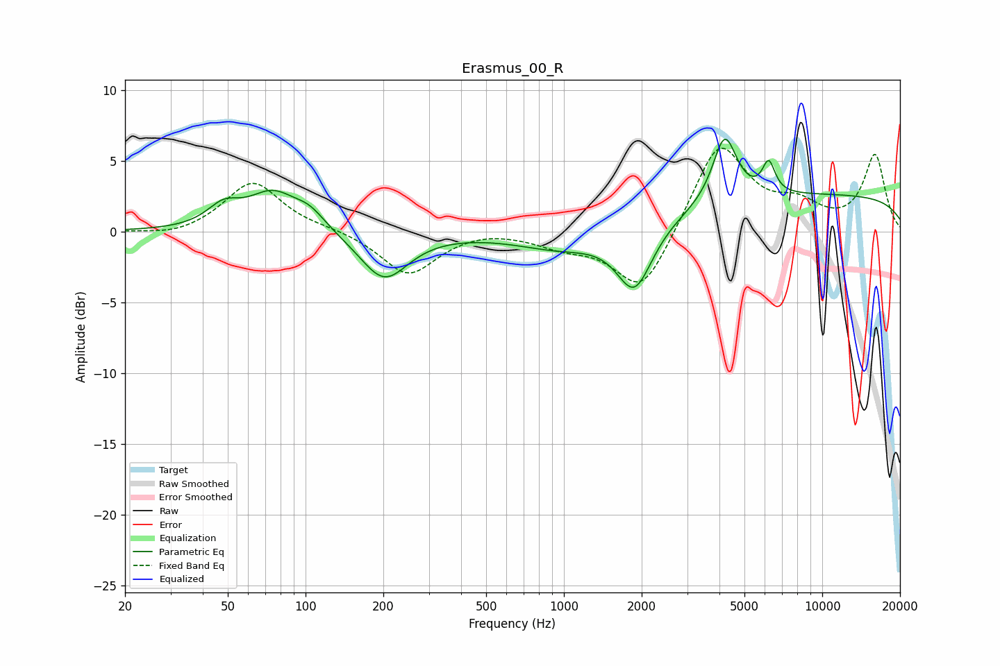

# Erasmus_00_R
See [usage instructions](https://github.com/jaakkopasanen/AutoEq#usage) for more options and info.

### Parametric EQs
Apply preamp of -6.6 dB when using parametric equalizer.

|   # | Type    |   Fc (Hz) |    Q |   Gain (dB) |
|-----|---------|-----------|------|-------------|
|   1 | Peaking |        48 | 2.26 |         1.4 |
|   2 | Peaking |        75 | 1.48 |         2.6 |
|   3 | Peaking |       104 | 2.28 |         1.1 |
|   4 | Peaking |       201 | 1.52 |        -3.4 |
|   5 | Peaking |       985 | 0.8  |        -1.3 |
|   6 | Peaking |      1876 | 2.04 |        -4.6 |
|   7 | Peaking |      2521 | 4.6  |         0   |
|   8 | Peaking |      4191 | 3.03 |         4.7 |
|   9 | Peaking |      6207 | 5.67 |         2.2 |
|  10 | Peaking |     10000 | 0.18 |         2.6 |

### Fixed Band EQs
When using fixed band (also called graphic) equalizer, apply preamp of **-6.0 dB** (if available) and set gains manually with these parameters.

|   # | Type    |   Fc (Hz) |    Q |   Gain (dB) |
|-----|---------|-----------|------|-------------|
|   1 | Peaking |        31 | 1.41 |        -0.4 |
|   2 | Peaking |        62 | 1.41 |         3.6 |
|   3 | Peaking |       125 | 1.41 |         0.2 |
|   4 | Peaking |       250 | 1.41 |        -3.1 |
|   5 | Peaking |       500 | 1.41 |         0.3 |
|   6 | Peaking |      1000 | 1.41 |        -0.9 |
|   7 | Peaking |      2000 | 1.41 |        -4.5 |
|   8 | Peaking |      4000 | 1.41 |         6.4 |
|   9 | Peaking |      8000 | 1.41 |         1.6 |
|  10 | Peaking |     16000 | 1.41 |         5.4 |

### Graphs

