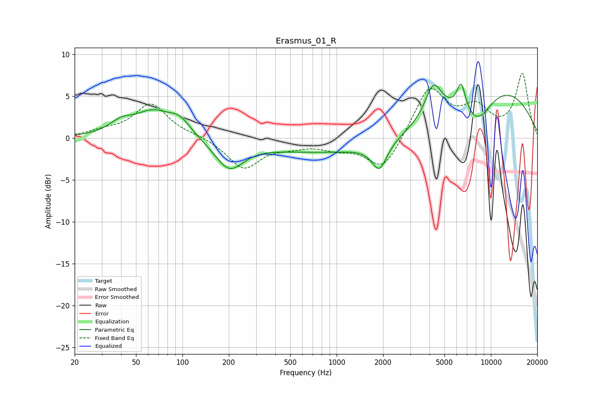

# Erasmus_01_R
See [usage instructions](https://github.com/jaakkopasanen/AutoEq#usage) for more options and info.

### Parametric EQs
Apply preamp of -6.6 dB when using parametric equalizer.

|   # | Type    |   Fc (Hz) |    Q |   Gain (dB) |
|-----|---------|-----------|------|-------------|
|   1 | Peaking |        40 | 1.84 |         1.3 |
|   2 | Peaking |        64 | 1.2  |         2.9 |
|   3 | Peaking |        96 | 1.93 |         1.8 |
|   4 | Peaking |       201 | 1.53 |        -3.5 |
|   5 | Peaking |      1160 | 0.27 |        -1.9 |
|   6 | Peaking |      1895 | 2.9  |        -3.2 |
|   7 | Peaking |      4241 | 2.58 |         4   |
|   8 | Peaking |      6419 | 4.86 |         3.3 |
|   9 | Peaking |      8178 | 1.32 |        -3.9 |
|  10 | Peaking |      9984 | 0.34 |         6.5 |

### Fixed Band EQs
When using fixed band (also called graphic) equalizer, apply preamp of **-7.8 dB** (if available) and set gains manually with these parameters.

|   # | Type    |   Fc (Hz) |    Q |   Gain (dB) |
|-----|---------|-----------|------|-------------|
|   1 | Peaking |        31 | 1.41 |         0.6 |
|   2 | Peaking |        62 | 1.41 |         4   |
|   3 | Peaking |       125 | 1.41 |         0.3 |
|   4 | Peaking |       250 | 1.41 |        -3.6 |
|   5 | Peaking |       500 | 1.41 |        -0.7 |
|   6 | Peaking |      1000 | 1.41 |        -1   |
|   7 | Peaking |      2000 | 1.41 |        -4   |
|   8 | Peaking |      4000 | 1.41 |         6   |
|   9 | Peaking |      8000 | 1.41 |         3.2 |
|  10 | Peaking |     16000 | 1.41 |         7.6 |

### Graphs

