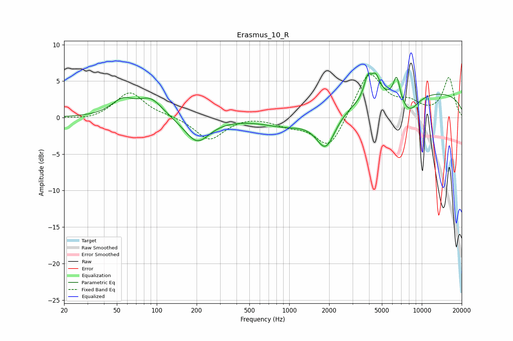

# Erasmus_10_R
See [usage instructions](https://github.com/jaakkopasanen/AutoEq#usage) for more options and info.

### Parametric EQs
Apply preamp of -6.2 dB when using parametric equalizer.

|   # | Type    |   Fc (Hz) |    Q |   Gain (dB) |
|-----|---------|-----------|------|-------------|
|   1 | Peaking |        55 | 1.66 |         2.1 |
|   2 | Peaking |        90 | 1.54 |         2.4 |
|   3 | Peaking |       202 | 1.5  |        -3.4 |
|   4 | Peaking |       961 | 0.81 |        -1.3 |
|   5 | Peaking |      1883 | 1.95 |        -4.9 |
|   6 | Peaking |      3904 | 5.15 |         2.6 |
|   7 | Peaking |      4483 | 3.99 |         2.8 |
|   8 | Peaking |      6459 | 5.42 |         3.4 |
|   9 | Peaking |      8013 | 1.76 |        -2.6 |
|  10 | Peaking |     10000 | 0.19 |         3.6 |

### Fixed Band EQs
When using fixed band (also called graphic) equalizer, apply preamp of **-6.0 dB** (if available) and set gains manually with these parameters.

|   # | Type    |   Fc (Hz) |    Q |   Gain (dB) |
|-----|---------|-----------|------|-------------|
|   1 | Peaking |        31 | 1.41 |        -0.4 |
|   2 | Peaking |        62 | 1.41 |         3.5 |
|   3 | Peaking |       125 | 1.41 |         0.2 |
|   4 | Peaking |       250 | 1.41 |        -3.1 |
|   5 | Peaking |       500 | 1.41 |         0.3 |
|   6 | Peaking |      1000 | 1.41 |        -0.9 |
|   7 | Peaking |      2000 | 1.41 |        -4.5 |
|   8 | Peaking |      4000 | 1.41 |         6.4 |
|   9 | Peaking |      8000 | 1.41 |         1.6 |
|  10 | Peaking |     16000 | 1.41 |         5.4 |

### Graphs

