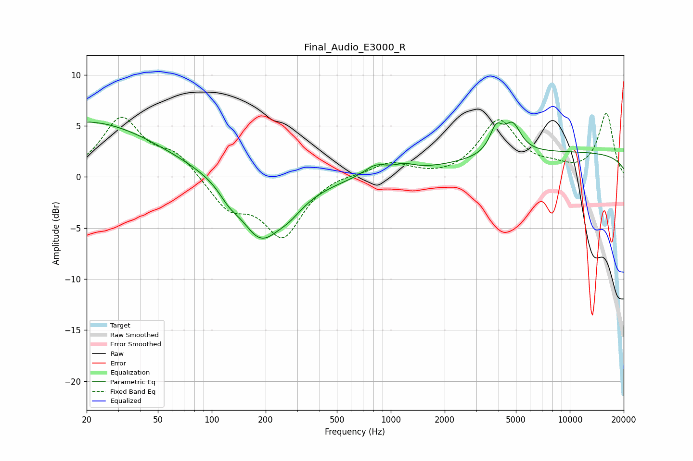

# Final_Audio_E3000_R
See [usage instructions](https://github.com/jaakkopasanen/AutoEq#usage) for more options and info.

### Parametric EQs
Apply preamp of -5.5 dB when using parametric equalizer.

|   # | Type    |   Fc (Hz) |    Q |   Gain (dB) |
|-----|---------|-----------|------|-------------|
|   1 | Peaking |        20 | 0.36 |         5.4 |
|   2 | Peaking |       125 | 2.62 |        -1   |
|   3 | Peaking |       186 | 1.25 |        -5.3 |
|   4 | Peaking |       271 | 0.92 |        -1.3 |
|   5 | Peaking |       272 | 2.16 |        -0.7 |
|   6 | Peaking |       821 | 2.18 |         1.1 |
|   7 | Peaking |      1191 | 2.37 |         0.6 |
|   8 | Peaking |      3884 | 3.9  |         2.4 |
|   9 | Peaking |      4797 | 3.03 |         2.7 |
|  10 | Peaking |     10000 | 0.18 |         2.4 |

### Fixed Band EQs
When using fixed band (also called graphic) equalizer, apply preamp of **-6.3 dB** (if available) and set gains manually with these parameters.

|   # | Type    |   Fc (Hz) |    Q |   Gain (dB) |
|-----|---------|-----------|------|-------------|
|   1 | Peaking |        31 | 1.41 |         5.6 |
|   2 | Peaking |        62 | 1.41 |         2.1 |
|   3 | Peaking |       125 | 1.41 |        -2.9 |
|   4 | Peaking |       250 | 1.41 |        -5.7 |
|   5 | Peaking |       500 | 1.41 |         0.4 |
|   6 | Peaking |      1000 | 1.41 |         1.4 |
|   7 | Peaking |      2000 | 1.41 |        -0.2 |
|   8 | Peaking |      4000 | 1.41 |         5.4 |
|   9 | Peaking |      8000 | 1.41 |         0.7 |
|  10 | Peaking |     16000 | 1.41 |         6.2 |

### Graphs

