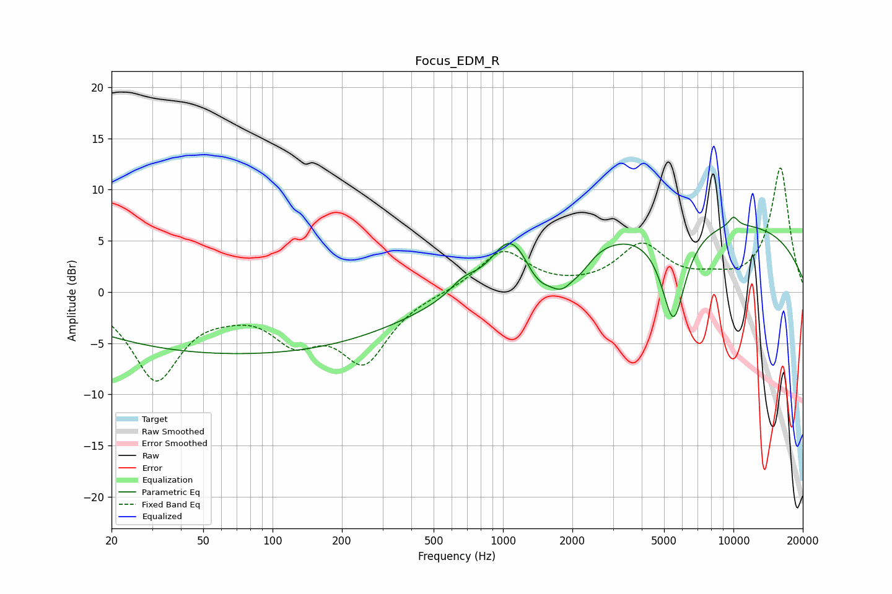

# Focus_EDM_R
See [usage instructions](https://github.com/jaakkopasanen/AutoEq#usage) for more options and info.

### Parametric EQs
Apply preamp of -7.4 dB when using parametric equalizer.

|   # | Type    |   Fc (Hz) |    Q |   Gain (dB) |
|-----|---------|-----------|------|-------------|
|   1 | Peaking |        72 | 0.18 |        -6   |
|   2 | Peaking |       671 | 2.5  |         1.2 |
|   3 | Peaking |      1050 | 1.95 |         3.6 |
|   4 | Peaking |      1183 | 3.04 |         0.7 |
|   5 | Peaking |      1435 | 2.04 |        -2.6 |
|   6 | Peaking |      1803 | 2.8  |        -2.3 |
|   7 | Peaking |      2176 | 2.66 |        -1.5 |
|   8 | Peaking |      5491 | 2.62 |        -9.3 |
|   9 | Peaking |      7349 | 0.18 |         7.1 |
|  10 | Peaking |     10000 | 5.98 |         0.9 |

### Fixed Band EQs
When using fixed band (also called graphic) equalizer, apply preamp of **-12.2 dB** (if available) and set gains manually with these parameters.

|   # | Type    |   Fc (Hz) |    Q |   Gain (dB) |
|-----|---------|-----------|------|-------------|
|   1 | Peaking |        31 | 1.41 |        -8.4 |
|   2 | Peaking |        62 | 1.41 |        -0.8 |
|   3 | Peaking |       125 | 1.41 |        -4   |
|   4 | Peaking |       250 | 1.41 |        -6.4 |
|   5 | Peaking |       500 | 1.41 |        -0   |
|   6 | Peaking |      1000 | 1.41 |         4   |
|   7 | Peaking |      2000 | 1.41 |         0.1 |
|   8 | Peaking |      4000 | 1.41 |         4.4 |
|   9 | Peaking |      8000 | 1.41 |         0.8 |
|  10 | Peaking |     16000 | 1.41 |        12.1 |

### Graphs

