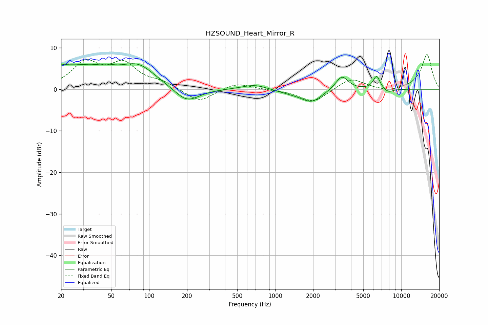

# HZSOUND_Heart_Mirror_R
See [usage instructions](https://github.com/jaakkopasanen/AutoEq#usage) for more options and info.

### Parametric EQs
Apply preamp of -6.3 dB when using parametric equalizer.

|   # | Type    |   Fc (Hz) |    Q |   Gain (dB) |
|-----|---------|-----------|------|-------------|
|   1 | Peaking |        22 | 0.5  |         5.5 |
|   2 | Peaking |        45 | 1.9  |         1   |
|   3 | Peaking |        82 | 1.03 |         4.8 |
|   4 | Peaking |       199 | 1.45 |        -3.6 |
|   5 | Peaking |       687 | 1.39 |         1.3 |
|   6 | Peaking |      1335 | 1.18 |        -0.8 |
|   7 | Peaking |      1950 | 1.74 |        -2.8 |
|   8 | Peaking |      3378 | 2.82 |         3.5 |
|   9 | Peaking |      6378 | 4.99 |         3.2 |
|  10 | Peaking |      7869 | 3.4  |        -0.9 |

### Fixed Band EQs
When using fixed band (also called graphic) equalizer, apply preamp of **-8.4 dB** (if available) and set gains manually with these parameters.

|   # | Type    |   Fc (Hz) |    Q |   Gain (dB) |
|-----|---------|-----------|------|-------------|
|   1 | Peaking |        31 | 1.41 |         6   |
|   2 | Peaking |        62 | 1.41 |         5.6 |
|   3 | Peaking |       125 | 1.41 |         1.4 |
|   4 | Peaking |       250 | 1.41 |        -3.2 |
|   5 | Peaking |       500 | 1.41 |         1.6 |
|   6 | Peaking |      1000 | 1.41 |        -0.1 |
|   7 | Peaking |      2000 | 1.41 |        -3.2 |
|   8 | Peaking |      4000 | 1.41 |         2.8 |
|   9 | Peaking |      8000 | 1.41 |        -0.7 |
|  10 | Peaking |     16000 | 1.41 |         8.4 |

### Graphs

