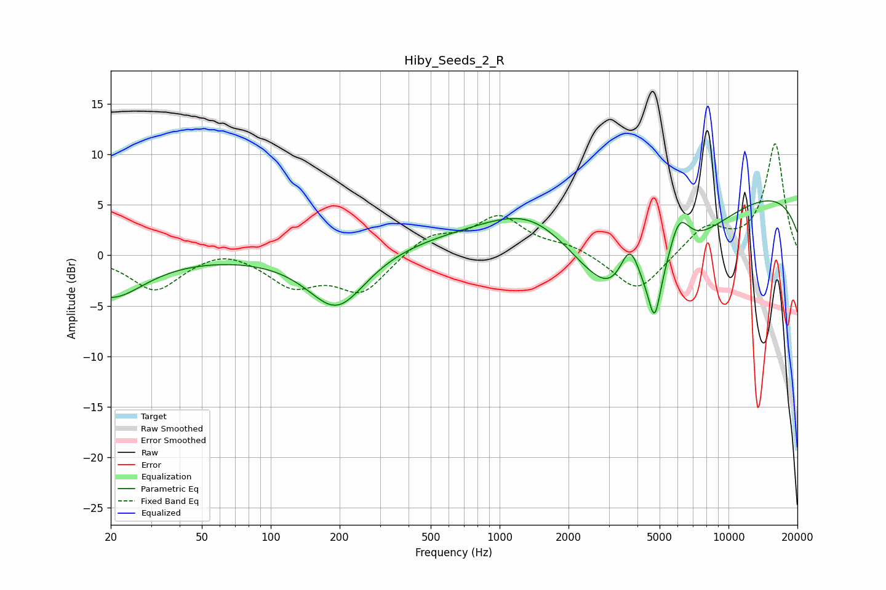

# Hiby_Seeds_2_R
See [usage instructions](https://github.com/jaakkopasanen/AutoEq#usage) for more options and info.

### Parametric EQs
Apply preamp of -5.5 dB when using parametric equalizer.

|   # | Type    |   Fc (Hz) |    Q |   Gain (dB) |
|-----|---------|-----------|------|-------------|
|   1 | Peaking |        20 | 0.98 |        -4.1 |
|   2 | Peaking |       195 | 1.09 |        -6   |
|   3 | Peaking |       654 | 0.28 |         1.8 |
|   4 | Peaking |      1414 | 0.69 |         4.5 |
|   5 | Peaking |      3713 | 2.81 |         6.1 |
|   6 | Peaking |      3723 | 0.59 |       -13.3 |
|   7 | Peaking |      3938 | 1.86 |         0.2 |
|   8 | Peaking |      4758 | 5.39 |        -4.6 |
|   9 | Peaking |      6077 | 2.82 |         4.5 |
|  10 | Peaking |      9864 | 0.19 |         7.1 |

### Fixed Band EQs
When using fixed band (also called graphic) equalizer, apply preamp of **-11.1 dB** (if available) and set gains manually with these parameters.

|   # | Type    |   Fc (Hz) |    Q |   Gain (dB) |
|-----|---------|-----------|------|-------------|
|   1 | Peaking |        31 | 1.41 |        -3.5 |
|   2 | Peaking |        62 | 1.41 |         0.9 |
|   3 | Peaking |       125 | 1.41 |        -2.8 |
|   4 | Peaking |       250 | 1.41 |        -3.6 |
|   5 | Peaking |       500 | 1.41 |         2   |
|   6 | Peaking |      1000 | 1.41 |         3.7 |
|   7 | Peaking |      2000 | 1.41 |         0.9 |
|   8 | Peaking |      4000 | 1.41 |        -3.8 |
|   9 | Peaking |      8000 | 1.41 |         2.7 |
|  10 | Peaking |     16000 | 1.41 |        11   |

### Graphs

