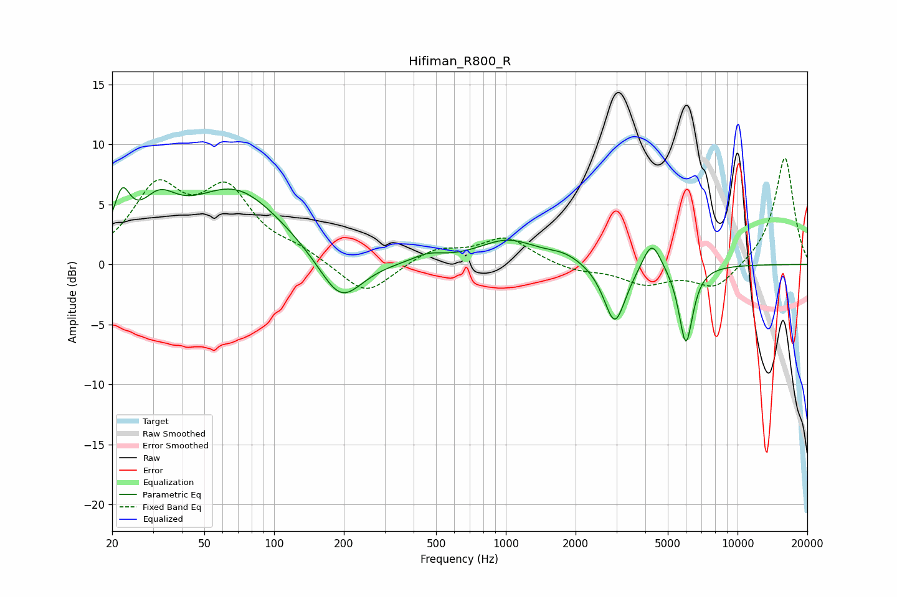

# Hifiman_R800_R
See [usage instructions](https://github.com/jaakkopasanen/AutoEq#usage) for more options and info.

### Parametric EQs
Apply preamp of -6.5 dB when using parametric equalizer.

|   # | Type    |   Fc (Hz) |    Q |   Gain (dB) |
|-----|---------|-----------|------|-------------|
|   1 | Peaking |        22 | 3.99 |         3.8 |
|   2 | Peaking |        32 | 1.8  |         3.1 |
|   3 | Peaking |        68 | 0.68 |         6.2 |
|   4 | Peaking |       194 | 1.49 |        -4.1 |
|   5 | Peaking |       461 | 2.16 |         0.6 |
|   6 | Peaking |      1018 | 1.11 |         2   |
|   7 | Peaking |      1794 | 1.88 |         0.6 |
|   8 | Peaking |      2953 | 3    |        -5.1 |
|   9 | Peaking |      4267 | 3.53 |         2.6 |
|  10 | Peaking |      5986 | 4.53 |        -6.6 |

### Fixed Band EQs
When using fixed band (also called graphic) equalizer, apply preamp of **-9.0 dB** (if available) and set gains manually with these parameters.

|   # | Type    |   Fc (Hz) |    Q |   Gain (dB) |
|-----|---------|-----------|------|-------------|
|   1 | Peaking |        31 | 1.41 |         5.9 |
|   2 | Peaking |        62 | 1.41 |         5.6 |
|   3 | Peaking |       125 | 1.41 |         0.9 |
|   4 | Peaking |       250 | 1.41 |        -2.7 |
|   5 | Peaking |       500 | 1.41 |         1.3 |
|   6 | Peaking |      1000 | 1.41 |         2.2 |
|   7 | Peaking |      2000 | 1.41 |        -0.6 |
|   8 | Peaking |      4000 | 1.41 |        -1.5 |
|   9 | Peaking |      8000 | 1.41 |        -2.1 |
|  10 | Peaking |     16000 | 1.41 |         9   |

### Graphs

