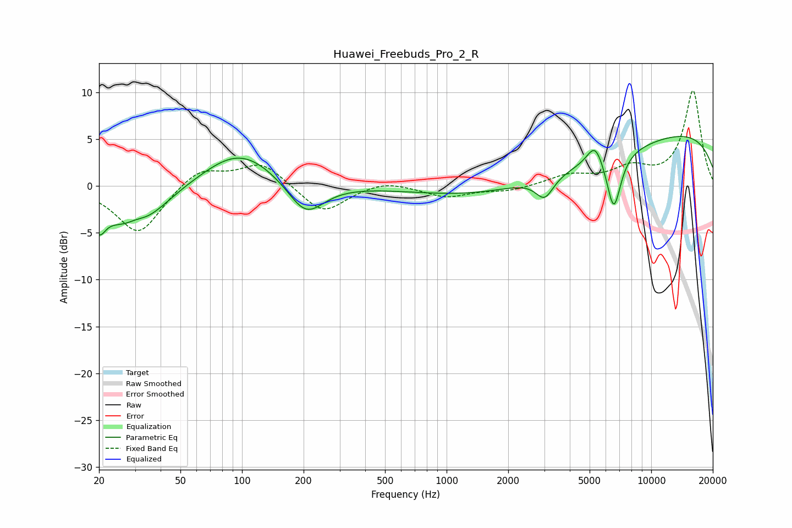

# Huawei_Freebuds_Pro_2_R
See [usage instructions](https://github.com/jaakkopasanen/AutoEq#usage) for more options and info.

### Parametric EQs
Apply preamp of -5.4 dB when using parametric equalizer.

|   # | Type    |   Fc (Hz) |    Q |   Gain (dB) |
|-----|---------|-----------|------|-------------|
|   1 | Peaking |        20 | 4.54 |        -2.6 |
|   2 | Peaking |        30 | 1.08 |        -5.5 |
|   3 | Peaking |        30 | 2.34 |         1.4 |
|   4 | Peaking |        97 | 0.79 |         4   |
|   5 | Peaking |       205 | 1.58 |        -3.7 |
|   6 | Peaking |      3015 | 3.26 |        -2.3 |
|   7 | Peaking |      3146 | 0.29 |        -3.6 |
|   8 | Peaking |      5323 | 3.43 |         2.4 |
|   9 | Peaking |      6561 | 3.87 |        -6   |
|  10 | Peaking |      9394 | 0.18 |         6.5 |

### Fixed Band EQs
When using fixed band (also called graphic) equalizer, apply preamp of **-10.3 dB** (if available) and set gains manually with these parameters.

|   # | Type    |   Fc (Hz) |    Q |   Gain (dB) |
|-----|---------|-----------|------|-------------|
|   1 | Peaking |        31 | 1.41 |        -5.2 |
|   2 | Peaking |        62 | 1.41 |         2   |
|   3 | Peaking |       125 | 1.41 |         2.5 |
|   4 | Peaking |       250 | 1.41 |        -3   |
|   5 | Peaking |       500 | 1.41 |         0.7 |
|   6 | Peaking |      1000 | 1.41 |        -1.2 |
|   7 | Peaking |      2000 | 1.41 |        -0.5 |
|   8 | Peaking |      4000 | 1.41 |         1.1 |
|   9 | Peaking |      8000 | 1.41 |         1.7 |
|  10 | Peaking |     16000 | 1.41 |        10.1 |

### Graphs

