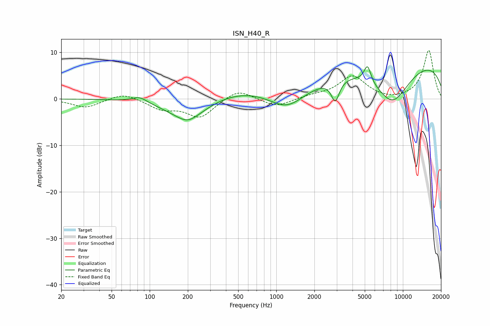

# ISN_H40_R
See [usage instructions](https://github.com/jaakkopasanen/AutoEq#usage) for more options and info.

### Parametric EQs
Apply preamp of -7.0 dB when using parametric equalizer.

|   # | Type    |   Fc (Hz) |    Q |   Gain (dB) |
|-----|---------|-----------|------|-------------|
|   1 | Peaking |        83 | 2.43 |         1.2 |
|   2 | Peaking |       199 | 0.87 |        -4.6 |
|   3 | Peaking |       200 | 2.22 |        -0.8 |
|   4 | Peaking |       530 | 0.48 |         2.1 |
|   5 | Peaking |      1219 | 0.99 |        -4.3 |
|   6 | Peaking |      2064 | 3.39 |        -0   |
|   7 | Peaking |      2925 | 4.45 |        -4.6 |
|   8 | Peaking |      5255 | 5.15 |         3.7 |
|   9 | Peaking |      8265 | 0.89 |        -9   |
|  10 | Peaking |      9629 | 0.18 |         8.9 |

### Fixed Band EQs
When using fixed band (also called graphic) equalizer, apply preamp of **-10.5 dB** (if available) and set gains manually with these parameters.

|   # | Type    |   Fc (Hz) |    Q |   Gain (dB) |
|-----|---------|-----------|------|-------------|
|   1 | Peaking |        31 | 1.41 |        -1.9 |
|   2 | Peaking |        62 | 1.41 |         1.4 |
|   3 | Peaking |       125 | 1.41 |        -2   |
|   4 | Peaking |       250 | 1.41 |        -3.9 |
|   5 | Peaking |       500 | 1.41 |         2.3 |
|   6 | Peaking |      1000 | 1.41 |        -1.8 |
|   7 | Peaking |      2000 | 1.41 |         0.6 |
|   8 | Peaking |      4000 | 1.41 |         4.8 |
|   9 | Peaking |      8000 | 1.41 |        -0.4 |
|  10 | Peaking |     16000 | 1.41 |        10.5 |

### Graphs

