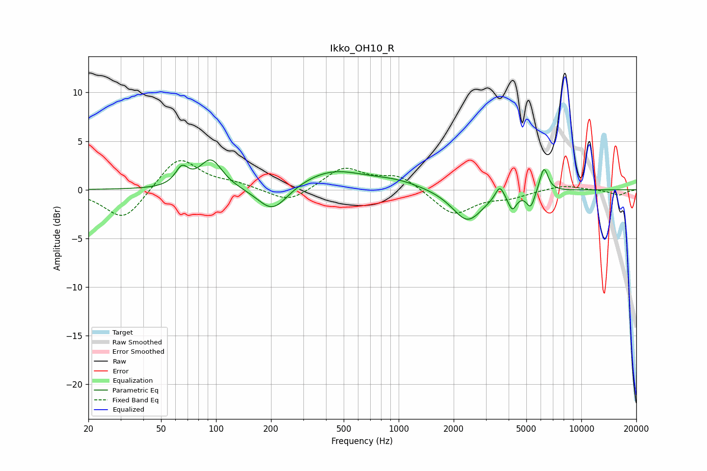

# Ikko_OH10_R
See [usage instructions](https://github.com/jaakkopasanen/AutoEq#usage) for more options and info.

### Parametric EQs
Apply preamp of -3.2 dB when using parametric equalizer.

|   # | Type    |   Fc (Hz) |    Q |   Gain (dB) |
|-----|---------|-----------|------|-------------|
|   1 | Peaking |        65 | 4.16 |         1.8 |
|   2 | Peaking |        94 | 2.3  |         3   |
|   3 | Peaking |       204 | 1.71 |        -2.7 |
|   4 | Peaking |       430 | 0.78 |         2   |
|   5 | Peaking |       977 | 1.04 |         0.7 |
|   6 | Peaking |      2381 | 1.72 |        -3.3 |
|   7 | Peaking |      3577 | 6    |         1.4 |
|   8 | Peaking |      4191 | 6    |        -1.6 |
|   9 | Peaking |      5281 | 6    |        -1.7 |
|  10 | Peaking |      6240 | 5.94 |         2.5 |

### Fixed Band EQs
When using fixed band (also called graphic) equalizer, apply preamp of **-3.1 dB** (if available) and set gains manually with these parameters.

|   # | Type    |   Fc (Hz) |    Q |   Gain (dB) |
|-----|---------|-----------|------|-------------|
|   1 | Peaking |        31 | 1.41 |        -3.3 |
|   2 | Peaking |        62 | 1.41 |         3.5 |
|   3 | Peaking |       125 | 1.41 |         0.5 |
|   4 | Peaking |       250 | 1.41 |        -1.4 |
|   5 | Peaking |       500 | 1.41 |         2.2 |
|   6 | Peaking |      1000 | 1.41 |         1.5 |
|   7 | Peaking |      2000 | 1.41 |        -2.6 |
|   8 | Peaking |      4000 | 1.41 |        -0.7 |
|   9 | Peaking |      8000 | 1.41 |         0.5 |
|  10 | Peaking |     16000 | 1.41 |        -0.6 |

### Graphs

