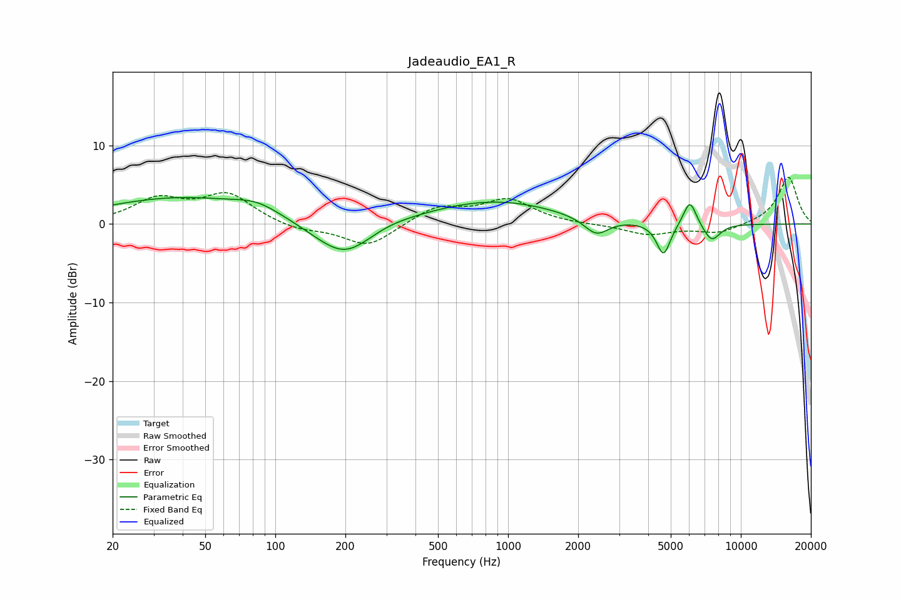

# Jadeaudio_EA1_R
See [usage instructions](https://github.com/jaakkopasanen/AutoEq#usage) for more options and info.

### Parametric EQs
Apply preamp of -3.5 dB when using parametric equalizer.

|   # | Type    |   Fc (Hz) |    Q |   Gain (dB) |
|-----|---------|-----------|------|-------------|
|   1 | Peaking |        39 | 0.42 |         3.3 |
|   2 | Peaking |        84 | 1.43 |         1.3 |
|   3 | Peaking |       199 | 1.06 |        -5.1 |
|   4 | Peaking |       286 | 1.19 |         0.8 |
|   5 | Peaking |       863 | 0.48 |         3   |
|   6 | Peaking |      1742 | 1.35 |        -0.1 |
|   7 | Peaking |      2395 | 2.68 |        -2.2 |
|   8 | Peaking |      4654 | 4.7  |        -4.2 |
|   9 | Peaking |      6040 | 4.94 |         3.3 |
|  10 | Peaking |      7492 | 3.62 |        -2.3 |

### Fixed Band EQs
When using fixed band (also called graphic) equalizer, apply preamp of **-6.1 dB** (if available) and set gains manually with these parameters.

|   # | Type    |   Fc (Hz) |    Q |   Gain (dB) |
|-----|---------|-----------|------|-------------|
|   1 | Peaking |        31 | 1.41 |         3   |
|   2 | Peaking |        62 | 1.41 |         3.6 |
|   3 | Peaking |       125 | 1.41 |        -0.8 |
|   4 | Peaking |       250 | 1.41 |        -2.9 |
|   5 | Peaking |       500 | 1.41 |         2.2 |
|   6 | Peaking |      1000 | 1.41 |         3   |
|   7 | Peaking |      2000 | 1.41 |        -0.1 |
|   8 | Peaking |      4000 | 1.41 |        -1.3 |
|   9 | Peaking |      8000 | 1.41 |        -1.2 |
|  10 | Peaking |     16000 | 1.41 |         6.1 |

### Graphs

