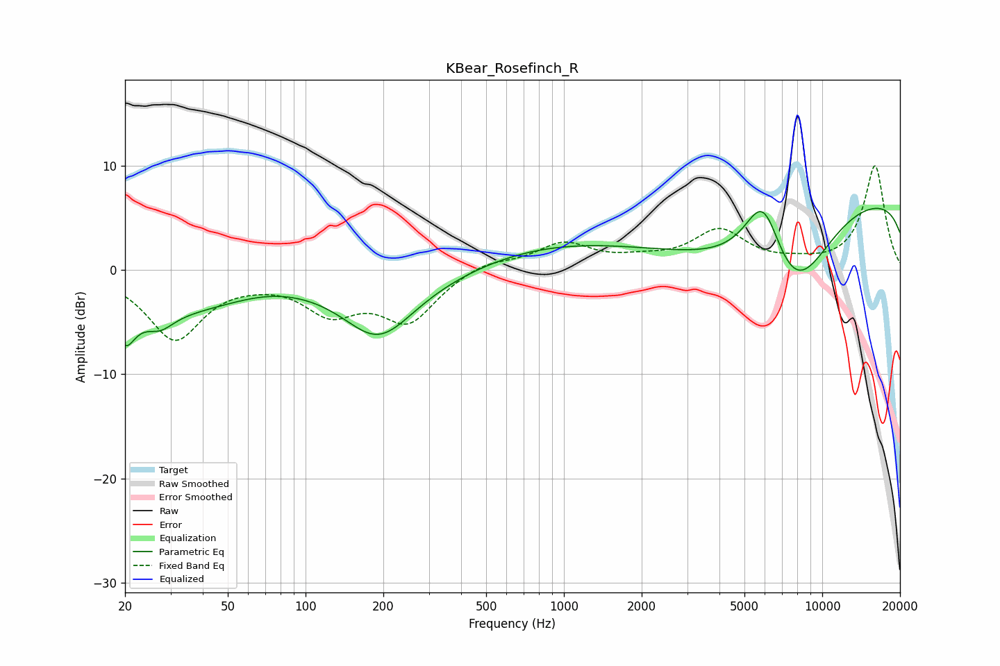

# KBear_Rosefinch_R
See [usage instructions](https://github.com/jaakkopasanen/AutoEq#usage) for more options and info.

### Parametric EQs
Apply preamp of -6.0 dB when using parametric equalizer.

|   # | Type    |   Fc (Hz) |    Q |   Gain (dB) |
|-----|---------|-----------|------|-------------|
|   1 | Peaking |        20 | 4.12 |        -2.6 |
|   2 | Peaking |        21 | 0.25 |        -4.4 |
|   3 | Peaking |        27 | 2.78 |        -1.3 |
|   4 | Peaking |        70 | 0.9  |         0.7 |
|   5 | Peaking |       191 | 0.97 |        -6.4 |
|   6 | Peaking |       337 | 0.39 |        -7.6 |
|   7 | Peaking |       376 | 0.31 |         8.6 |
|   8 | Peaking |      5913 | 1.74 |         8   |
|   9 | Peaking |      7669 | 0.45 |       -20   |
|  10 | Peaking |     10000 | 0.23 |        17.3 |

### Fixed Band EQs
When using fixed band (also called graphic) equalizer, apply preamp of **-10.1 dB** (if available) and set gains manually with these parameters.

|   # | Type    |   Fc (Hz) |    Q |   Gain (dB) |
|-----|---------|-----------|------|-------------|
|   1 | Peaking |        31 | 1.41 |        -6.5 |
|   2 | Peaking |        62 | 1.41 |        -0.4 |
|   3 | Peaking |       125 | 1.41 |        -3.6 |
|   4 | Peaking |       250 | 1.41 |        -4.7 |
|   5 | Peaking |       500 | 1.41 |         1   |
|   6 | Peaking |      1000 | 1.41 |         2.5 |
|   7 | Peaking |      2000 | 1.41 |         0.7 |
|   8 | Peaking |      4000 | 1.41 |         3.6 |
|   9 | Peaking |      8000 | 1.41 |         0.4 |
|  10 | Peaking |     16000 | 1.41 |        10   |

### Graphs

