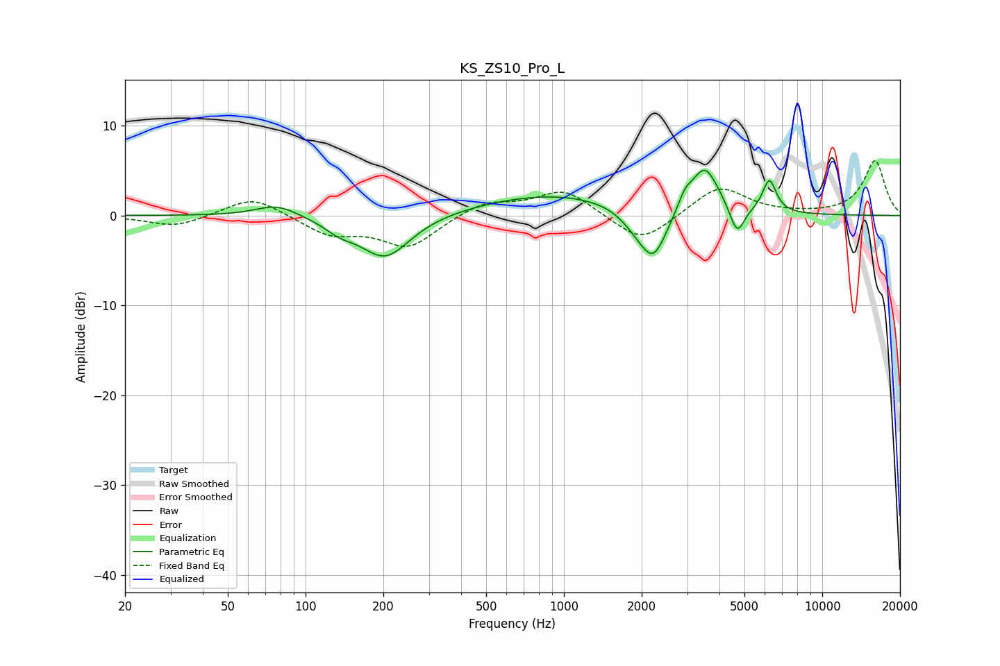

# KS_ZS10_Pro_L
See [usage instructions](https://github.com/jaakkopasanen/AutoEq#usage) for more options and info.

### Parametric EQs
Apply preamp of -5.1 dB when using parametric equalizer.

|   # | Type    |   Fc (Hz) |    Q |   Gain (dB) |
|-----|---------|-----------|------|-------------|
|   1 | Peaking |        77 | 1.72 |         1.4 |
|   2 | Peaking |       135 | 2.51 |        -1   |
|   3 | Peaking |       203 | 1.43 |        -4.9 |
|   4 | Peaking |       920 | 0.47 |         2.4 |
|   5 | Peaking |      1910 | 2.27 |        -1.5 |
|   6 | Peaking |      2226 | 2.65 |        -5.3 |
|   7 | Peaking |      2940 | 5.66 |         1.3 |
|   8 | Peaking |      3507 | 2.6  |         5.3 |
|   9 | Peaking |      4683 | 4.97 |        -3.3 |
|  10 | Peaking |      6240 | 5.24 |         3.7 |

### Fixed Band EQs
When using fixed band (also called graphic) equalizer, apply preamp of **-6.2 dB** (if available) and set gains manually with these parameters.

|   # | Type    |   Fc (Hz) |    Q |   Gain (dB) |
|-----|---------|-----------|------|-------------|
|   1 | Peaking |        31 | 1.41 |        -1.3 |
|   2 | Peaking |        62 | 1.41 |         2.2 |
|   3 | Peaking |       125 | 1.41 |        -2.1 |
|   4 | Peaking |       250 | 1.41 |        -3.5 |
|   5 | Peaking |       500 | 1.41 |         1.6 |
|   6 | Peaking |      1000 | 1.41 |         2.9 |
|   7 | Peaking |      2000 | 1.41 |        -3.3 |
|   8 | Peaking |      4000 | 1.41 |         3.3 |
|   9 | Peaking |      8000 | 1.41 |         0.1 |
|  10 | Peaking |     16000 | 1.41 |         6.1 |

### Graphs

