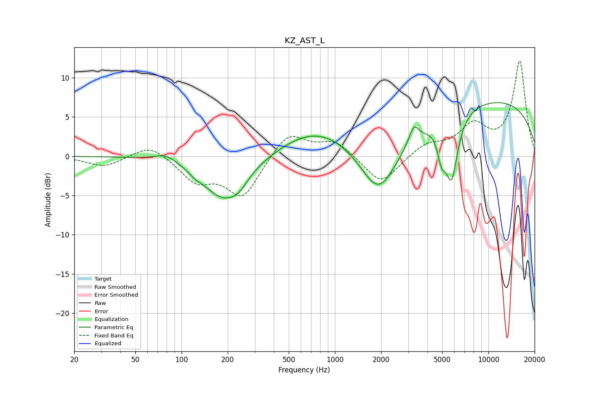

# KZ_AST_L
See [usage instructions](https://github.com/jaakkopasanen/AutoEq#usage) for more options and info.

### Parametric EQs
Apply preamp of -6.9 dB when using parametric equalizer.

|   # | Type    |   Fc (Hz) |    Q |   Gain (dB) |
|-----|---------|-----------|------|-------------|
|   1 | Peaking |        80 | 1.89 |         1   |
|   2 | Peaking |       124 | 3.29 |        -0.4 |
|   3 | Peaking |       190 | 1.02 |        -5.5 |
|   4 | Peaking |       238 | 2.69 |        -0.9 |
|   5 | Peaking |       772 | 0.6  |         3.5 |
|   6 | Peaking |      1933 | 1.16 |        -7.2 |
|   7 | Peaking |      3263 | 4.69 |         2.1 |
|   8 | Peaking |      4948 | 5.5  |        -3.1 |
|   9 | Peaking |      5747 | 3.33 |        -8.2 |
|  10 | Peaking |     10000 | 0.23 |         7.2 |

### Fixed Band EQs
When using fixed band (also called graphic) equalizer, apply preamp of **-12.2 dB** (if available) and set gains manually with these parameters.

|   # | Type    |   Fc (Hz) |    Q |   Gain (dB) |
|-----|---------|-----------|------|-------------|
|   1 | Peaking |        31 | 1.41 |        -1.3 |
|   2 | Peaking |        62 | 1.41 |         1.7 |
|   3 | Peaking |       125 | 1.41 |        -3   |
|   4 | Peaking |       250 | 1.41 |        -5.1 |
|   5 | Peaking |       500 | 1.41 |         3.2 |
|   6 | Peaking |      1000 | 1.41 |         1.9 |
|   7 | Peaking |      2000 | 1.41 |        -3.7 |
|   8 | Peaking |      4000 | 1.41 |         1.5 |
|   9 | Peaking |      8000 | 1.41 |         3.6 |
|  10 | Peaking |     16000 | 1.41 |        12   |

### Graphs

