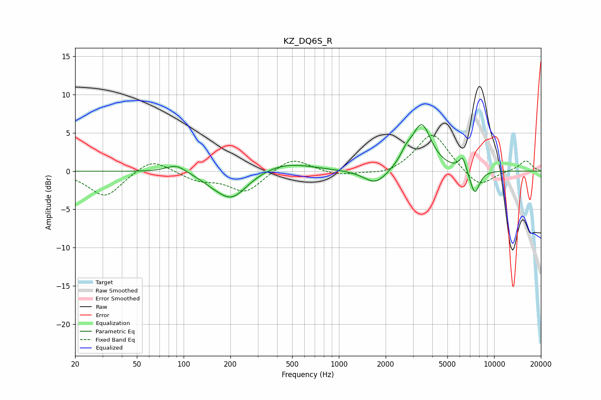

# KZ_DQ6S_R
See [usage instructions](https://github.com/jaakkopasanen/AutoEq#usage) for more options and info.

### Parametric EQs
Apply preamp of -6.2 dB when using parametric equalizer.

|   # | Type    |   Fc (Hz) |    Q |   Gain (dB) |
|-----|---------|-----------|------|-------------|
|   1 | Peaking |        89 | 2.2  |         1.1 |
|   2 | Peaking |       151 | 1.81 |        -0.5 |
|   3 | Peaking |       204 | 1.42 |        -3.3 |
|   4 | Peaking |       206 | 1.4  |        -0.2 |
|   5 | Peaking |       456 | 0.86 |         1.2 |
|   6 | Peaking |      1722 | 1.9  |        -2   |
|   7 | Peaking |      2702 | 3.85 |         1.2 |
|   8 | Peaking |      3410 | 2.26 |         6   |
|   9 | Peaking |      6268 | 6    |         1.9 |
|  10 | Peaking |      7503 | 4.23 |        -3.2 |

### Fixed Band EQs
When using fixed band (also called graphic) equalizer, apply preamp of **-4.8 dB** (if available) and set gains manually with these parameters.

|   # | Type    |   Fc (Hz) |    Q |   Gain (dB) |
|-----|---------|-----------|------|-------------|
|   1 | Peaking |        31 | 1.41 |        -3.4 |
|   2 | Peaking |        62 | 1.41 |         1.9 |
|   3 | Peaking |       125 | 1.41 |        -1.1 |
|   4 | Peaking |       250 | 1.41 |        -2.7 |
|   5 | Peaking |       500 | 1.41 |         1.9 |
|   6 | Peaking |      1000 | 1.41 |        -0.6 |
|   7 | Peaking |      2000 | 1.41 |        -0.6 |
|   8 | Peaking |      4000 | 1.41 |         5.1 |
|   9 | Peaking |      8000 | 1.41 |        -2.3 |
|  10 | Peaking |     16000 | 1.41 |         1.4 |

### Graphs

