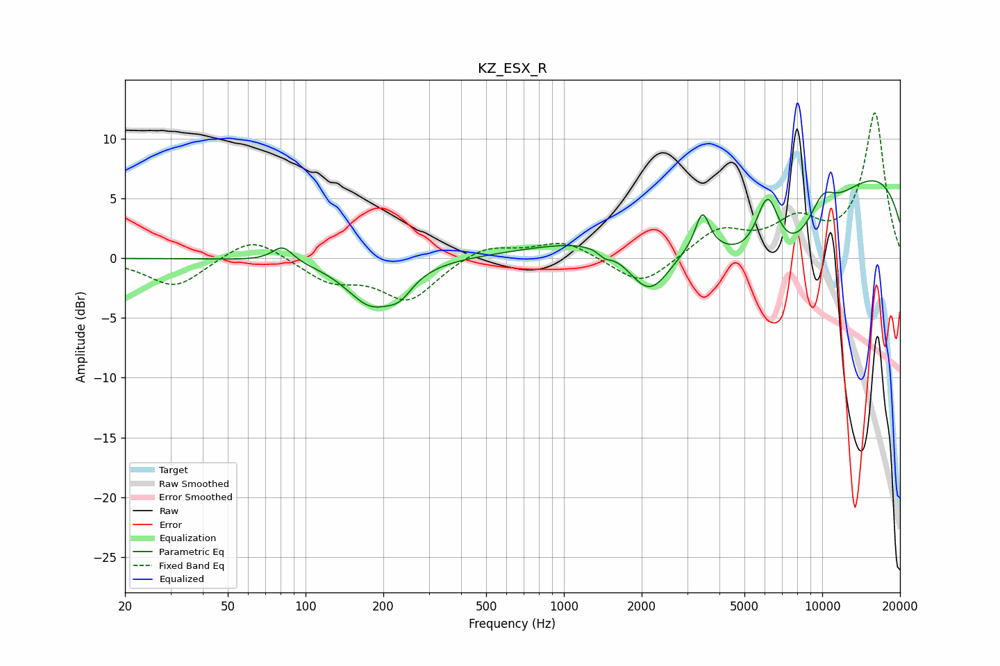

# KZ_ESX_R
See [usage instructions](https://github.com/jaakkopasanen/AutoEq#usage) for more options and info.

### Parametric EQs
Apply preamp of -6.6 dB when using parametric equalizer.

|   # | Type    |   Fc (Hz) |    Q |   Gain (dB) |
|-----|---------|-----------|------|-------------|
|   1 | Peaking |        82 | 3.56 |         1.4 |
|   2 | Peaking |       179 | 1.48 |        -3.7 |
|   3 | Peaking |       232 | 2.78 |        -1.5 |
|   4 | Peaking |      1440 | 5.69 |        -0.5 |
|   5 | Peaking |      2147 | 1.55 |        -5.3 |
|   6 | Peaking |      3436 | 5.18 |         3.2 |
|   7 | Peaking |      6144 | 2.85 |         6.1 |
|   8 | Peaking |      6500 | 0.5  |       -12.5 |
|   9 | Peaking |      8697 | 0.18 |        11.7 |
|  10 | Peaking |     10000 | 2.43 |         2.3 |

### Fixed Band EQs
When using fixed band (also called graphic) equalizer, apply preamp of **-12.3 dB** (if available) and set gains manually with these parameters.

|   # | Type    |   Fc (Hz) |    Q |   Gain (dB) |
|-----|---------|-----------|------|-------------|
|   1 | Peaking |        31 | 1.41 |        -2.5 |
|   2 | Peaking |        62 | 1.41 |         2   |
|   3 | Peaking |       125 | 1.41 |        -1.8 |
|   4 | Peaking |       250 | 1.41 |        -3.4 |
|   5 | Peaking |       500 | 1.41 |         1.2 |
|   6 | Peaking |      1000 | 1.41 |         1.5 |
|   7 | Peaking |      2000 | 1.41 |        -2.5 |
|   8 | Peaking |      4000 | 1.41 |         2.3 |
|   9 | Peaking |      8000 | 1.41 |         2.7 |
|  10 | Peaking |     16000 | 1.41 |        12.1 |

### Graphs

