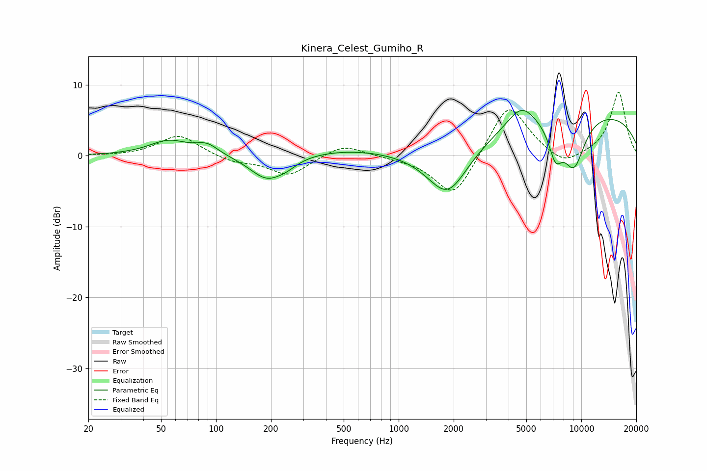

# Kinera_Celest_Gumiho_R
See [usage instructions](https://github.com/jaakkopasanen/AutoEq#usage) for more options and info.

### Parametric EQs
Apply preamp of -6.5 dB when using parametric equalizer.

|   # | Type    |   Fc (Hz) |    Q |   Gain (dB) |
|-----|---------|-----------|------|-------------|
|   1 | Peaking |        55 | 1.32 |         2.1 |
|   2 | Peaking |        89 | 2.28 |         1.4 |
|   3 | Peaking |       190 | 1.47 |        -3.5 |
|   4 | Peaking |       245 | 2.47 |        -0.7 |
|   5 | Peaking |       531 | 0.51 |         1   |
|   6 | Peaking |      1854 | 1.22 |        -7.2 |
|   7 | Peaking |      4693 | 1.86 |         3   |
|   8 | Peaking |      7223 | 3.49 |        -4.4 |
|   9 | Peaking |      9109 | 1.99 |        -7.2 |
|  10 | Peaking |     10000 | 0.22 |         6.3 |

### Fixed Band EQs
When using fixed band (also called graphic) equalizer, apply preamp of **-9.0 dB** (if available) and set gains manually with these parameters.

|   # | Type    |   Fc (Hz) |    Q |   Gain (dB) |
|-----|---------|-----------|------|-------------|
|   1 | Peaking |        31 | 1.41 |        -0.1 |
|   2 | Peaking |        62 | 1.41 |         3   |
|   3 | Peaking |       125 | 1.41 |        -0.9 |
|   4 | Peaking |       250 | 1.41 |        -2.8 |
|   5 | Peaking |       500 | 1.41 |         1.7 |
|   6 | Peaking |      1000 | 1.41 |        -0.2 |
|   7 | Peaking |      2000 | 1.41 |        -6.2 |
|   8 | Peaking |      4000 | 1.41 |         7.7 |
|   9 | Peaking |      8000 | 1.41 |        -1.8 |
|  10 | Peaking |     16000 | 1.41 |         9   |

### Graphs

